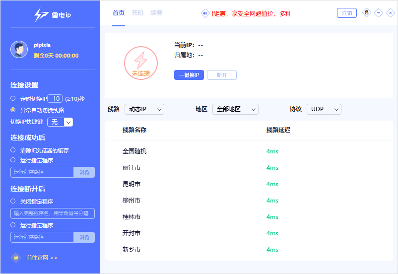
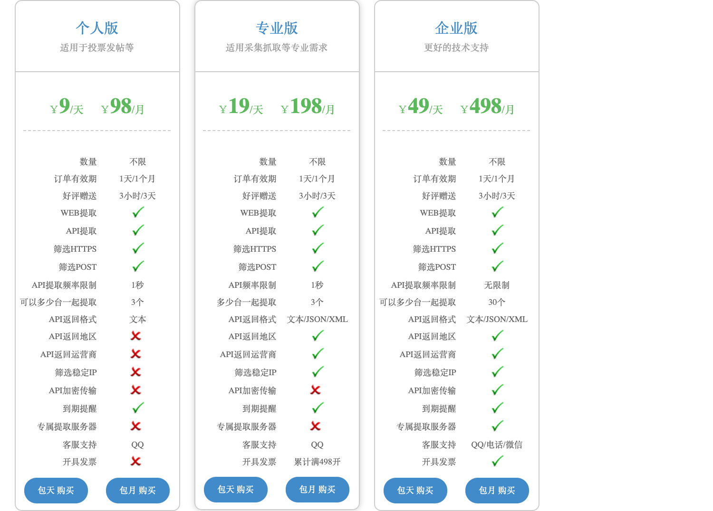
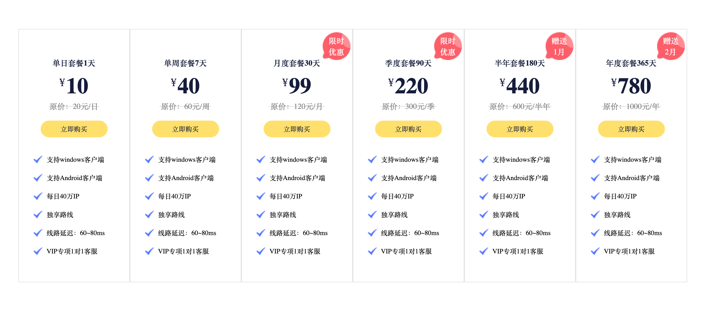
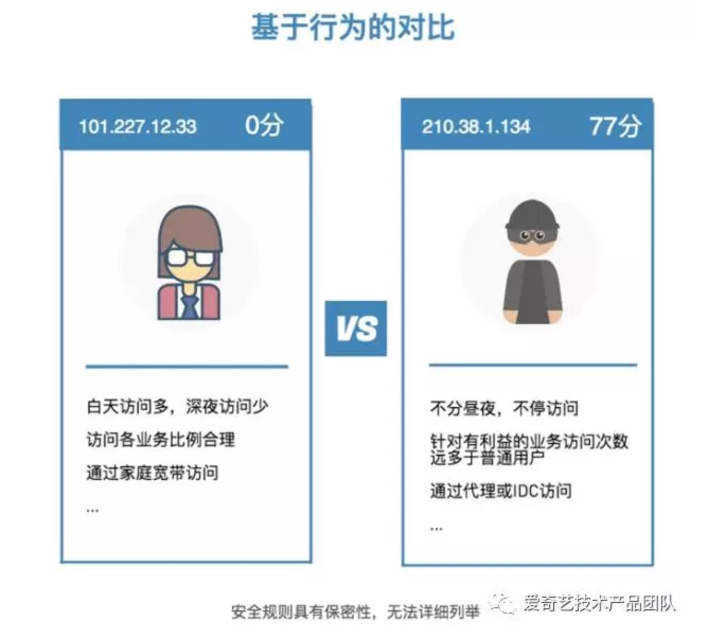
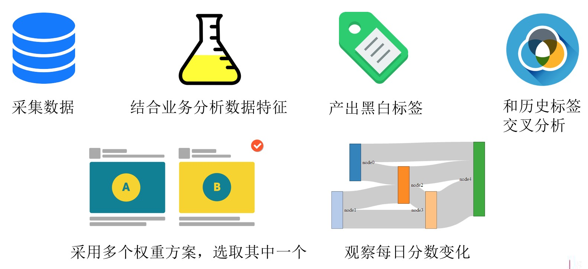
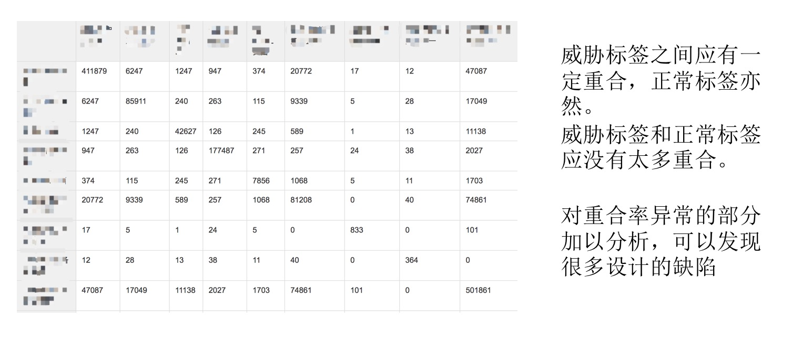
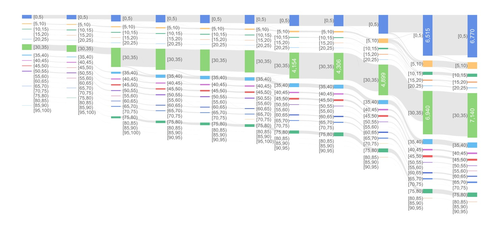

# IP风险识别

IP维度作为一个常见、容易理解、获取难度低的维度，经常是最先被想起来的一个维度。有时候参与业务需求讨论，产品经理会兴致勃勃给我讲他定的IP风控策略。但很多时候这些策略都不够专业，实际中不会有太大的作用。我这里举几个常见例子：

#### 你们能不能把阿里云那种IP都封禁掉？
这种IP我们统称为IDC IP，有不少第三方公司都提供IDC IP库。大部分时候是挺准的，但是实际经验来看会有误杀。

#### 我们想把每小时请求超过100次的IP都封禁掉，你看行不行？
技术上并不难。但是效果很有限，因为现在刚入行的黑产都知道IP要经常换一换，接入代理IP或者ADSL秒拨IP。

下图是某秒拨换IP工具截图，可以看出功能齐全、布点遍布全国。

下图是类似服务的报价，价格还不贵。

所以黑产多换一换IP，就可以很轻松的绕过IP频率类的策略，这类策略的效果自然就不好了。

#### 市面上有很多IP威胁标签，好用吗？
IP情报几乎是每一家威胁情报服务商的标配，分为代理、撞库、垃圾邮件、Web服务器、扫描器等标签。但也不能盲目使用，原因有二：
1. 根据实际体验来看，不同标签“误杀”情况相差很大，不能直接拦截，需要仔细评估。
2. 最主要的是这个“误杀”有时不是由于情报服务商搜集错了情报，而是用法的问题。往往服务商只会标记一个IP发生过哪些攻击，但是这并不意味着这个IP就是专门做这件事的。一个普通人用自己家的宽带做了几天坏事，这个宽带IP就会被标记。但很明显你不能把这个宽带IP给完全拦截，毕竟还有很多正常人在使用。

## 一个解决思路

不考虑IP的属性，单纯看一个IP的流量是否符合真人。于是接下来介绍我在爱奇艺设计的基于流量、行为的IP识别体系————IP信誉分。

_以下内容取自于唯品会SRC城市沙龙的公开内容，虽然有大量细节未公开，但是不影响大家理解背后的思想_

## IP信誉分

融合爱奇艺内部多个系统的数据, 参考第三方数据,综合衡量一个IP的长期行为, 得到一个-100到100的信誉分.

### IP信誉分特点

1. 分数制

使用-100到+100的分数，表示一个访问爱奇艺的IP的威胁程度，0代表中性；正分表示有威胁，分数越高越有威胁；负分表示无威胁，分数越低越无威胁。

不仅直观，同时业务方可以结合自己的业务，决定规则的松紧程度。

2. 引入负分

第三方情报服务，正常IP和无威胁情报的IP都是0分，无法区分。我们引入负分表示一个IP偏向正常。包含两类IP：
* 不仅无恶意行为，而且有正常行为
* 有恶意行为，但是有更多或者更置信的正常行为，总体偏向无恶意

主要应用在公共出口防误杀

3. 只关注于访问爱奇艺的IP

因为：
* 不访问爱奇艺的IP对爱奇艺的威胁是0
* 对爱奇艺有威胁的IP都访问过爱奇艺
* 威胁越大的IP往往请求越多，产生的痕迹就越多，我们就可以做的越准确

4. 更适合爱奇艺

绝大部分数据均来自爱奇艺的各个业务，分析指标结合了各个业务的特点，识别更精确

例如194.44.172.210这个IP
* A公司告知这是一个代理，并且给了50分
* B公司只告知这是一个HTTP代理

IP信誉分结合爱奇艺Passport业务，判断这个IP业务行为严重异常，给出了100分的满分，识别准确无误

5. 公共出口识别更准确

不仅可以识别出公共出口，而且识别出了这个公共出口是什么，包括：企业、商场、酒店、机场、地铁、公交车等公共设施出口IP

_第三方威胁情报服务也许也能做到这一点，但是并没有开放出来_

### IP信誉分研发过程

### IP信誉分的特征提取

### IP信誉分的特征交叉检测

### IP信誉分的每日检测

