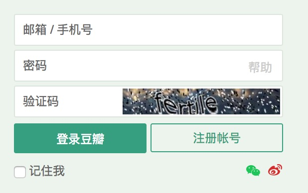
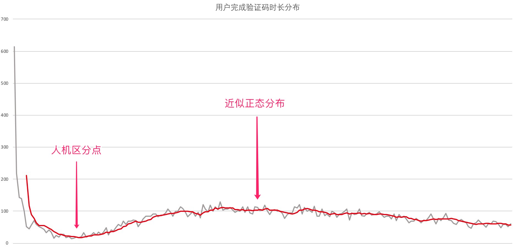

# 阈值的选取

前文提到的很多类似“连续10次输错密码阻止登录”的规则很好理解，但是有一个问题，这个“10次”是怎么来的？

我们通常称这个值为阈值，读yù值可不是fá值。

一般这个值的选取是为了将正常行为和恶意行为区分开，那么我们就要找到两种行为的边界。

### 真实的案例

很多网站在登陆、注册的时候都会填验证码，目的是防止批量注册、撞库等攻击。实战中传统验证码的效果并不好，因为使用文字识别（OCR）可以轻松识别字母和数字的验证码，速度比正常人快很多。

于是我们决定增加一条规则，“识别验证码的时间少于X秒的时候，进入手机短信校验”。可是这个X定多少呢？我们来看一下用户识别、填写、提交一个验证码的总时间分布图。横轴是时间，纵轴是人数。灰色是实际曲线，红色是趋势曲线。

有些人手速很快，有些人手速很慢，但大部分应该中等快慢，直觉上应该是一个正态分布。从图上我们确实发现了一个类似正态分布的曲线。但是左边那个特别高的是怎么回事？手速特别快的人应该很少才对呀？为什么又多了起来？

其实，那就是机器攻击的部分。机器识别验证码的速度实在是太快了，快到比最快的真人还要快很多，导致了曲线在左侧的上升。我们最终选择了左侧箭头标记的地方作为我们这条规则的阈值。也就是说，我们认为这个标记左侧的很可能是机器，右侧的我们倾向认为是真人。

### 总结

选取一个阈值的大致步骤
1. 要尽量搜集相关数据
2. 观察数据分布
3. 从分布中找到区分黑产和普通用户分界点
4. 依据分界点和影响范围选取阈值
5. 规则上线后的跟近
