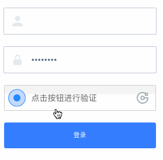

# 验证手段

验证用户身份是大部分网站很常见的功能，在登录、改密码、绑定手机、敏感信息操作时，我们都要求用户“证明自己是自己”。

验证手段最常见的是用户名密码登陆，这里的用户名可以是手机、邮箱或者昵称。除此之外，本章再介绍一些其他的验证手段

### 干掉密码？

### 两步验证

两步验证(2-Step Verification)又叫双因子验证(2-Factor Verification)，简单理解就是除了用户名和密码，还要进行第二步验证。往往是网站向已绑定的手机号或者邮箱发送一串随机数字，用户在网站或者App上填写收到的数字

下图是Google的两步验证

还有一个类似的思路叫上行短信验证（上面Google的例子是下行短信验证），页面上显示一串数字，请用户使用已绑定的手机向企业的号码发送这串数据。

下图是网易的上行短信校验

上行短信校验比较少见，个人认为是体验问题，用户要输入网站手机号（10位），又要输入随机数（6位），还要花用户1毛钱。体验不是一般差！

### 人机验证

