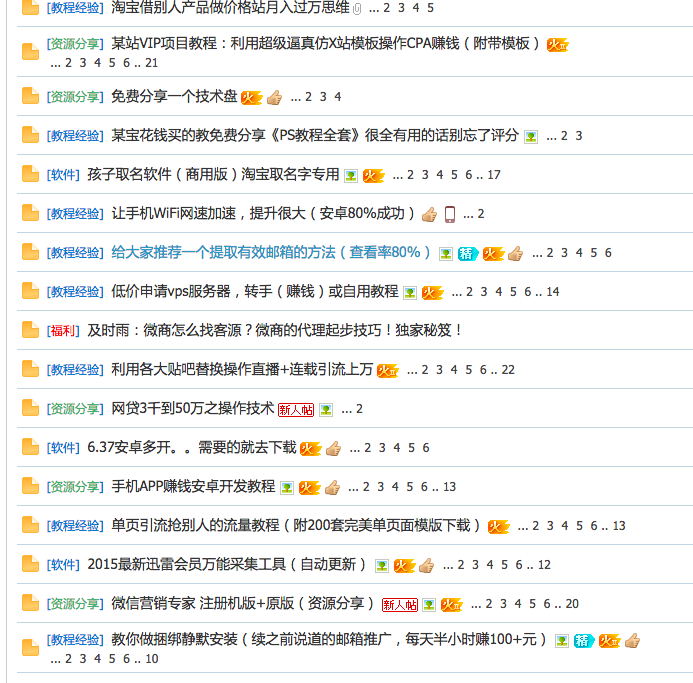

# 利益

说起风控的时候，人们经常提起“黑产”，他们是我们的对手。很多时候我坐在办公室，盯着监控问自己“我面对的究竟是怎样的一群对手？” 我没法准确给一个定义，但是我至少知道这帮人逐利，而这一点是最重要的。黑产的参与者不停地在发现利益，而我们将利用“利益”发现他们的踪迹，并通过压薄他们的利益来对抗他们。

>赔钱的生意没人做，杀头的生意有人做

当我和别人说起来黑产的时候，大部分人都会想到电影里面的黑客，轻轻松松就可以黑近别人的电脑。虽然电影里的有点夸张，不过黑产中确实有很多在技术上有长处的人负责解决“技术问题”。

除了普通人脑海中的“黑客”，还有很多人负责体力活。下图就是很有名的App Store刷榜照片。在综艺活动投票、App评分这两个领域，有很多这样的人参与。

黑产从业者里有很多“兼职”，有学生也有无稳定工作的人，有时候你会发现这帮人很有分享精神，兼职论坛论坛也是红红火火。有一次我们被刷，监控到的时间和论坛的发帖时间只隔了3分钟，可见这种论坛的传播效率。

过年的时候我坐在亲戚家，一个亲戚知道我在互联网公司工作，便问我知不知道刷帖，QQ群说有人拉他干，问我是不是骗人的，是不是要管他要押金，是不是传销。我的这位亲戚是一个老实本分的人，只不过家里因为治病生活很拮据，又赶上工厂效益不好，想找个挣钱的事情。

实际上参与黑产的人并不都是大奸大恶，有很多是普通人，因为没有稳定的经济来源只好做些临时工作。很多时候他们不知道这个是违法的，因为他们不知道整件事是怎么运转的，对于他们而言只是动了动鼠标、输了几个数字，这怎么能算违法。

