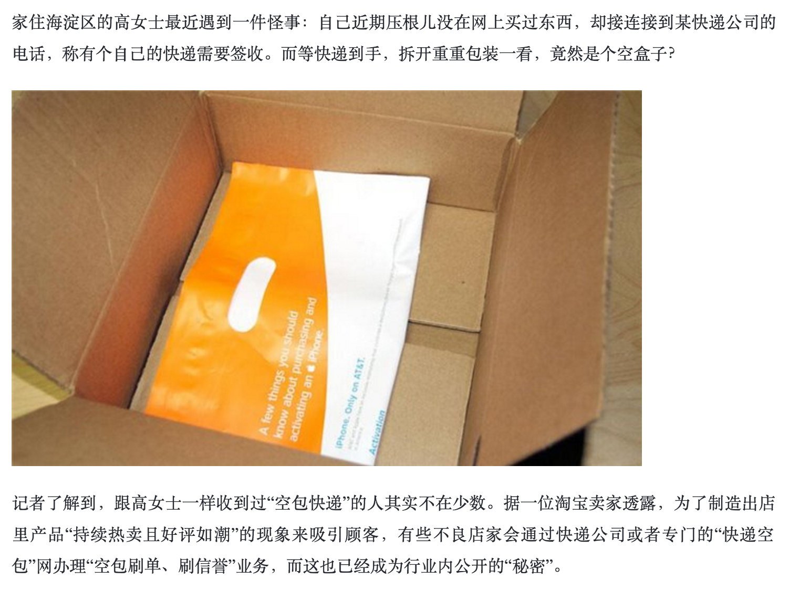

# 再谈利益

前几章中列举了一些常见的风控思路和手段，但其实没有哪一条是完美的，可以完全杜绝风险的发生，不是因为技术不够高超，而是因为黑产和我们都在进化，每当我们想出对抗方案的时候，黑产也会进化出新手段，也就是所谓的“道高一尺魔高一丈”。

但是我们并不需要一个完美的方案，我们要做的只是**尽量压低黑产的利益**，直到他们无利可图。让我们再把之前的公式拿出来

**不做黑产收入 </=/> 做黑产收入 - 可见和不可见的直接成本**

多维度判断、高危名单、分析用户习惯是为了更准确识别恶意请求，**逼迫黑产使用更复杂的手段从而提升成本**。例如雇佣更多的人、购买更多机器、花更多时间在工具研发上。

限制频率是为了降低黑产的请求次数，**压低黑产单位时间内的收入**。

###实例

前文提到过，电商网站为了防止商家刷单，会检测商家的物流信息。但是商家联合黑产很快绕过了这个检测，生生创造出了一个产业——“空包”。

商家为了伪造订单的物流信息，会和专门的空包公司联合，真的在商家店中下单、填写真实存在的收货地址、付费，只不过包裹里往往什么都没有，收到包裹的人也不是下单的人。

增加了物流检测，虽然没有切断商家刷单的可能性，但是并不意味着毫无意义。因为空包也是需要成本的，一个大概是2-4元。

增加了物流检测后，商家刷单的门槛一下子提升了几万到十几万。这个成本足以遏制小的刷单商家，但是对于利益丰厚的商家，还是不够的。所以我们还需要别的途径。

顺便说一句，这种空包手法，给普通人的生活带了一定影响，很多没有下过单的人收到了空包裹后，往往会吓一跳。对于电商网站、物流的形象都是负面的。

