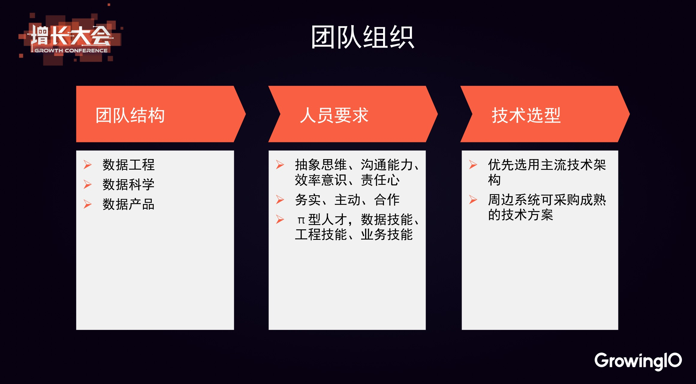
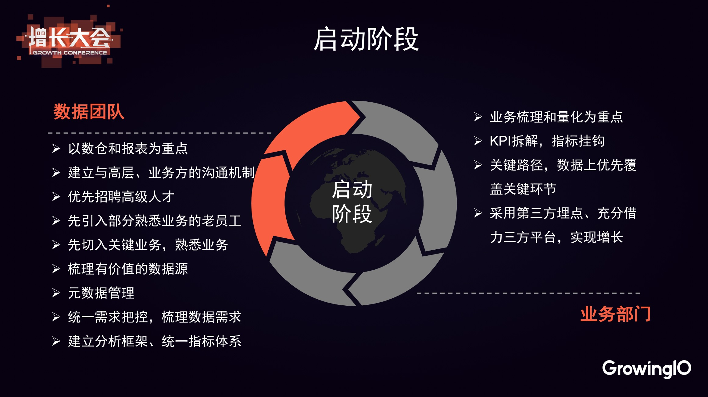
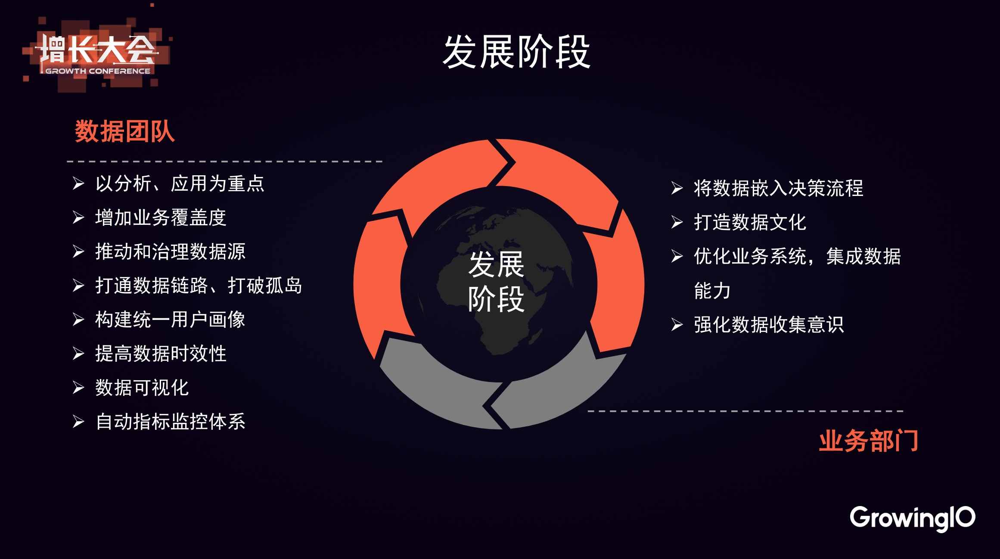
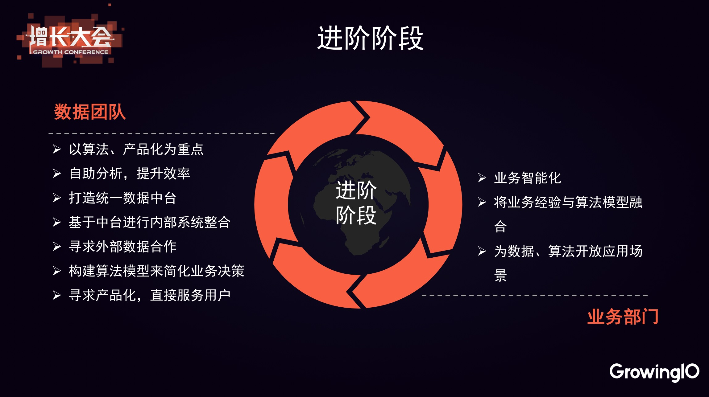

# 风控数据分析

做风控十分依赖数据，所以以下三个事情将是很重要的：
1. 合理的数据分析发展过程
2. 合理的数据存储和ETL
3. 强劲的分析工具

## 合理的数据分析发展过程

* 站在公司角度，业务有优先级，风险也有不同严重性。
* 站在团队角度，人力总是有限的，技术的积累也是有先后的。

所以一个公司风控的发展是有次序的，在数据分析的建设上也是有次序的。其实不仅风控数据分析是这样，大部分数据分析都是这样。

对于这个发展过程，我个人比较认同玖富数据总监孙微先生的总结，思考比我深入。会议上孙微先生是站在业务运营的角度来提的，但是大部分思想和风控运营是一样的。

_包含GrowingIO字样的截图取自于「 GrowingIO 2018 增长大会上海站」,已得到GrowingIO授权_

首先是团队组织，孙微先生列出的这些条都很好，我结合风控的特点补充一些。

**务实**：最近几年安全行业是一个热门的行业，各种新奇名词频出。对新趋势保持关注是必要的，但是数据分析并不是找几个模型这么简单，靠几个“微创新”就可以有大幅提高。耐心的梳理各业务数据、一步步推演整套分析架构这些略显“枯燥”的事目前仍是重要的事。

**合作**：安全风控部门往往需要对接很多业务，如果是大公司，有几十个大大小小的业务是很常见的。更不用说乙方公司要对接的是大量的公司。风控部门天然就是合作非常多的部门，沟通能力是招聘时一定要考虑的因素。

以下结合风控的特点补充一些：

**打通数据链路、打破孤岛**：风控刚开始的时候，往往每个业务的防控比较独立。稍微成熟一点之后肯定会出一些跨业务的策略，也就是说联防联控。例如“登录高危用户，在参加活动时也是高危”。要是想实现这种规则，那么就有以下要求：

1. 宏观上，关联的业务数据应该可以关联分析
2. 微观上，在行为链路中，后续的风险点应该可以关联之前风险点的情况（风险等级等）。

我认为这是实现精细化运营的必要步骤，技术上需要规则引擎、数据处理、缓存的顶层设计，逻辑上需要熟悉业务的专家耐心梳理。

需要指出的事，对安全部门而言“打通数据链路、打破孤岛”是一件辛苦的“脏活”，有时候对业务方而言是一件“添麻烦”的事。大家都认同价值，但是价值又很难评估。大家都认同这件事的专业性，但是又认为这件事很传统、没有创新。在普遍不踏实的互联网文化下，能做好这件事并不容易。
