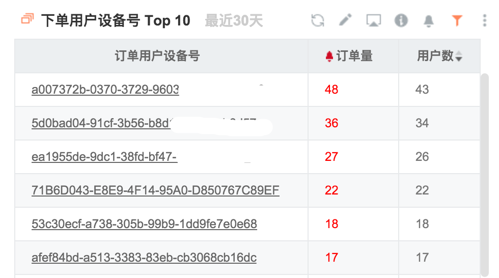

# 蛛丝马迹

>###“It is not the answer that enlightens, but the question.” – Decouvertes

在风控中，提出一个好的问题十分重要：

1. 为什么昨天凌晨1点的订单比均值高？
2. 为什么派券比往常快了半个小时？
3. 为什么最近有很多连续的IP访问我们？

而我们提出这些有价值的问题是通过发现不同寻常的数据，所以我们要对风控数据有很强的搜集能力和分析能力，当然还有人对数据的敏感。

###态势感知

阿里有一个概念叫态势感知，其中有一点就是要收集大量数据，包括用户业务数据、用户行为数据、服务器日志、客户端执行环境等方方面面的数据，并对这些数据进行统计和监控。

以下是我们监控刷单行为的表格，为了加强效果，我扩大了数据时间范围到30天。

