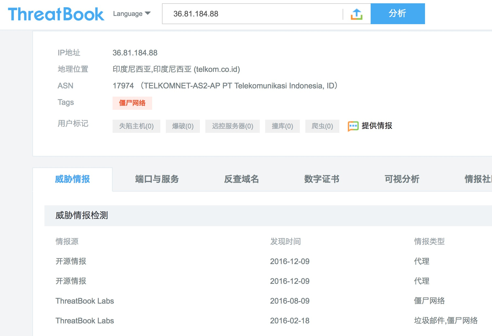

# 高危名单

我们给我们的业务加上一条限制：每天登录失败超过100次，阻止登录。这个限制已经运行了好几天了，让我们看看过去三天每天拦下了谁

第一天

| 用户名 | 密码错误次数 |
| -- | -- |
| Jim | 100 |
| Tom | 90 |
| Lily | 10 |

第二天

| 用户名 | 密码错误次数 |
| -- | -- |
| Jim | 100 |
| Kate | 90 |
| Lily | 10 |

第三天

| 用户名 | 密码错误次数 |
| -- | -- |
| Jim | 100 |
| Jane | 20 |
| Pete | 5 |

发现什么了吗？

我们的Jim这个用户要么是不知道怎么找回密码，要么就是被黑客盯上了。

还有Lily这个用户，已经连续两天尝试了10次登录。虽然很可疑，但是比起Jim还是好很多。

### 提取高危名单

我们通过整理数据，经常会发现一些用户、手机号、银行卡号长期多次有可疑行为，但是我们不能100%确定，我们可以将这些数据整理到单独的表中，根据其出现频率和行为严重程度整理为一个高危名单（有时称作灰名单）。

例如我们将上文中的数据整理为如下的高危名单，并假设星级越高，越可疑。

| 用户名 | 可疑程度 |
| -- | -- |
| Lily | ★★★ |
| Jim | ★★★★★★★★★★ |

Lily似乎做了一点不好的事情，但是我们并不能确定她是不是真的有问题，我们给她标记为3星，有待观察。

Jim做了很多坏事，我们几乎可以确定他就是一个坏人，我们标记为10星。等Jim明天访问我们的网站的时候，我们立刻阻止他登录，并进入全面的身份认证流程，即便他当天还没有登录失败过。

### 黑名单

当我们100%确定某条数据有问题的时候，我们给将它加入我们的黑名单库，也可以将这条数据相关的数据也都加入黑名单。当请求来自黑名单时，我们可以不进行更多的判定，直接让它尝尝最严格的认证，甚至完全阻止请求。

常见的黑名单有用户ID、设备号、手机号码、地址、银行卡号、IP、城市、国家等。

### 第三方威胁情报

在安全领域中，我们将这些高危名单、黑名单进行整理，称作威胁信息或者威胁情报。如果你还未积累起足够的威胁情报，又急需补足这个短板，你可以选择向第三方公司购买。

国内比较有名气的第三方情报公司有(排名不分先后)：

* [微步在线](https://x.threatbook.cn)
* [同盾科技](https://www.tongdun.cn/)
* [邦盛科技](http://www.bsfit.com.cn/)
* [蚂蚁金服 蚁盾](https://b.alipay.com/order/productDetail.htm?productId=2016040624336707)
* [威胁猎人](https://threathunter.cn/)

因为微步的在线查询较为方便，且免费。下面以微步为例进行简单介绍。

在Threatbook上，你可以查询到一个IP的威胁信息，例如所属位置、运营商这类基础信息，还有我们更关心的安全相关的信息。上图可以看到36.81.184.88这个IP最近一次在2016年12月被标记为代理IP。

### 开放的名单

我们除了从自己公司的数据中统计高危名单，也会参考其他公司开放的数据。因为黑产通常会在不同网站重复使用一个手机号、IP、银行卡，使用开放数据意味着你不需要从头开始。

例如：

* 携程安全云 https://security.ctrip.com/
* 阿里云IP表 http://www.tcpiputils.com/browse/as/37963
