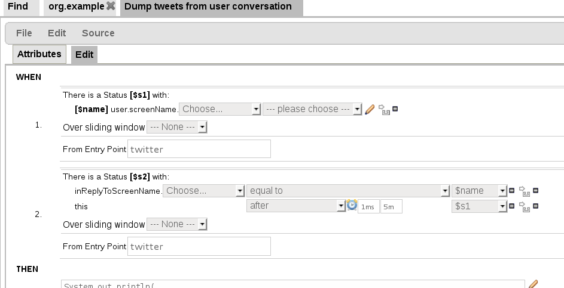

# 规则和模型

### 规则

前几章介绍了多种风控的手段，在讲述过程中我们经常会设计一些检测逻辑，例如一个用户每天只能登录10次。实际上在风控领域，这个检测逻辑被称为“规则”。

### 规则引擎

通常我们需要从数据中发现问题，找到黑产的规律，跟进规律找到对抗方案，形成一条或者多条规则。通常我们还会使用“规则引擎”定义、发布、执行规则。

我们可以用数学上的表达式来表示一条规则

| 规则 | 等价表达式 |
| -- | -- |
| 每天登录超过10次，弹一个数字验证码 | WHEN 每天登录次数 > 10 THEN 弹数字验证码 |
| 使用了新的收获地址，发送手机验证码 | WHEN 历史收货地址 length > 0 AND 新收获地址 not in 历史收货地址 THEN 手机验证|

下图是规则引擎Drools的规则配置界面

### 模型

随着大数据的成熟，大数据和数据模型也别应用到了风控中。模型可以满足很多规则无法满足的分析。

### 规则 VS 模型

结合我自己的经验总结一下两者的对比，如下表

|  | 规则 | 模型 |
| -- | -- | -- |
| 技术难度 | 简单 | 复杂 |
| 开发周期 | 短 | 长 |
| 执行速度 | 快 | 慢 |
| 应用场景 | 多 | 少 |
|被突破难度|较容易|较难|

从上面的表格中可以看出，规则在很多方面都力压模型。在实际中，各大公司也是主要基于规则，甚至很多有名的公司只有规则。

其实两者并没有好坏的区分，针对的场景不一样罢了。模型对于很多规则不支持的场景都给予很好的补充。只是这个补充需要一个过程（较长的开发过程和研究过程），而在瞬息万变的对抗中，这个过程是人们等不及的。