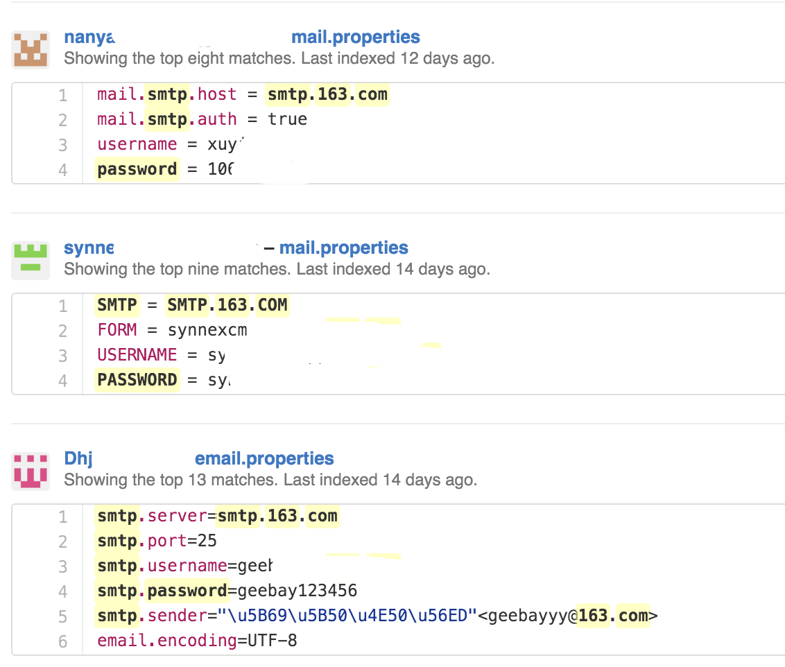
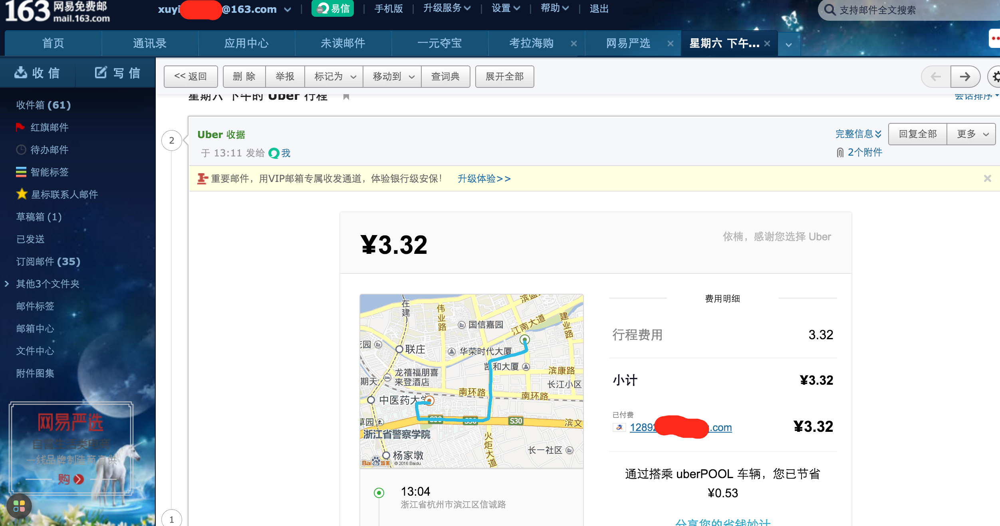

# 安全从自身做起

威胁可能来自公司外部，也可能来自公司内部。

### 泄露密码

每一年都会发生因为密码泄露导致的恶性事件，其中大部分都是人为疏忽导致的。有时被泄露的是企业邮箱，导致了内部信息泄露。甚至出现过服务器密码在github上泄露，导致服务器被黑。

对于企业，避免类似问题的方法有

1. 日常灌输安全意识
2. 3个月左右强迫员工更改密码
3. 敏感信息禁止在邮件或者第三方提供的工具中沟通

### 公司无线网络

### 实例

我们在github上随便搜一下 “smtp password 163.com”，可以搜到大量网易邮箱的账号和密码，随便试了两个，就有一个成功了。

有趣的是，网易明显对Github做了扫描，并在明显位置给用户了一个提示

但是这个人的信息还是泄露了，行程一览无余。

