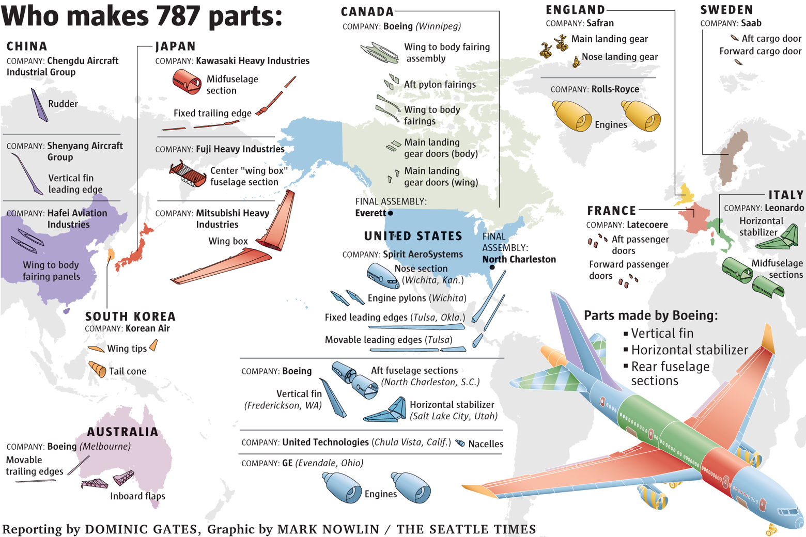
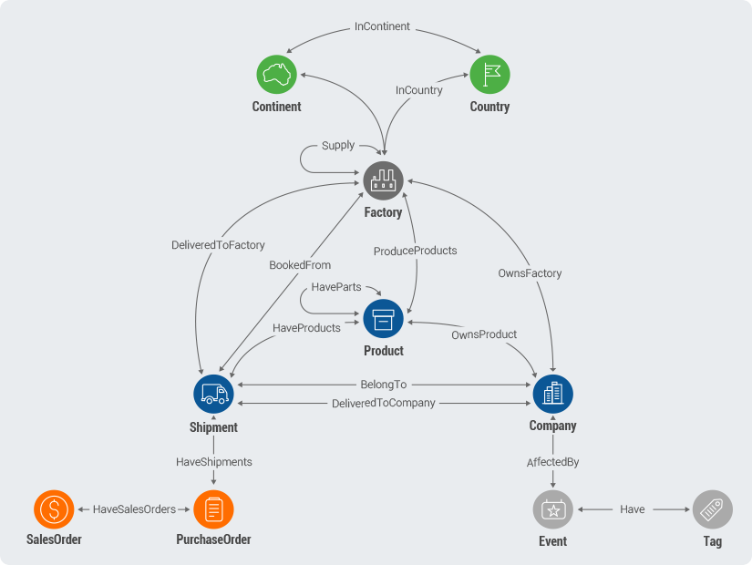
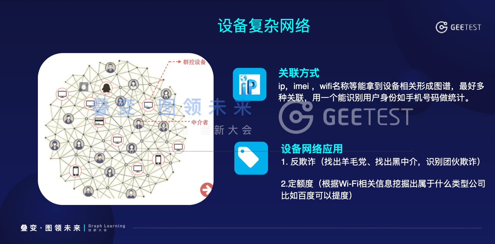
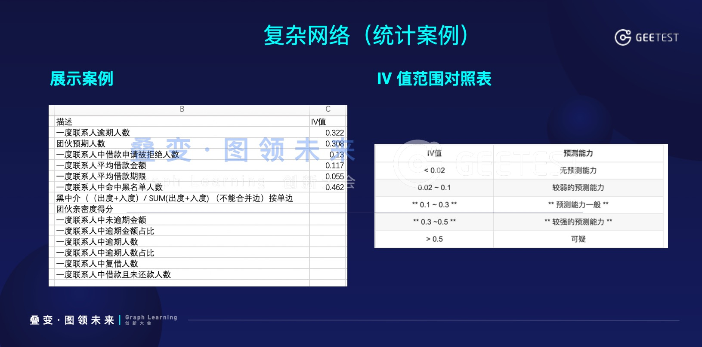
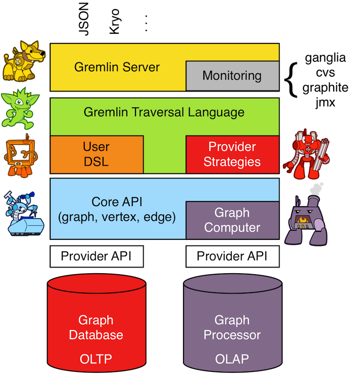
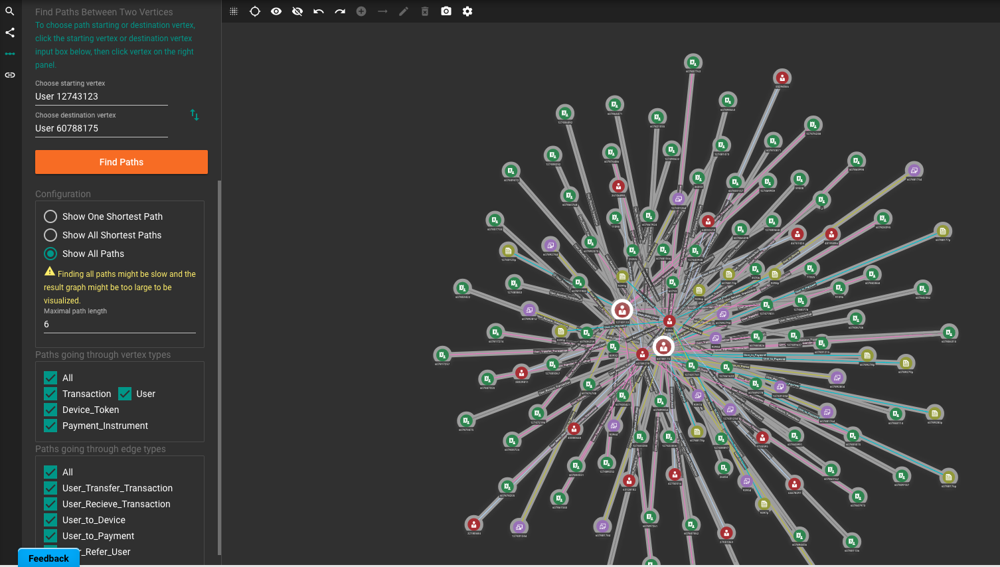
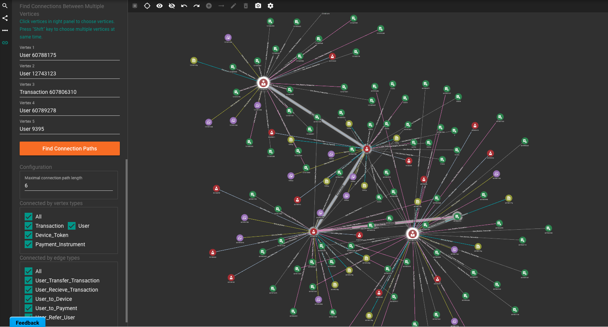
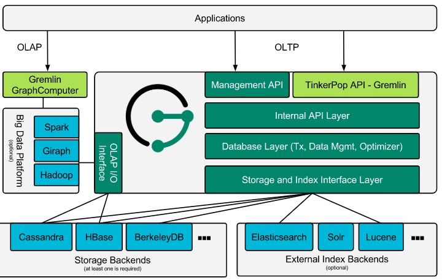
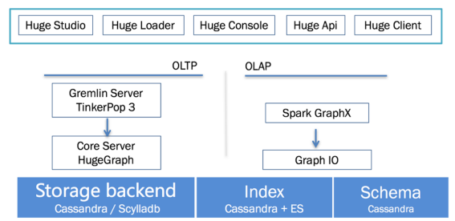
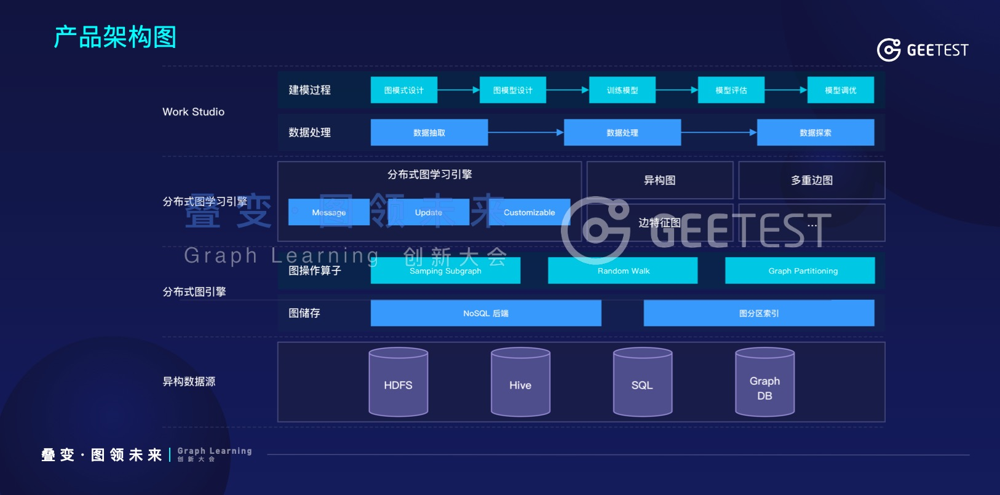

# 使用图技术进行管理分析

学过数据结构读者肯定对“图”这个概念不陌生，图由节点和边组成。数据结构课程也介绍过“深度优先搜索”、“广度优先搜索”、“Dijkstra算法”等概念。本章介绍的图数据库就是保存图结构，并支持图算法的一类数据库。

在很多业务中，实体和实体存在丰富的关系，例如用户和订单、订单和银行卡、用户和地址、银行卡和发卡行之间都存在关系，如果将这些实体通过关系全部连起来就成了图。如果使用MySQL之类的数据库实现这一业务模型时，需要建立不同表，然后通过各个表的主键关联起来。当我们想顺着关系查询数据时，需要写子查询或者join来实现，有时需要嵌套多个子查询或者join，甚至还需要临时表来存储中间结果。

使用图数据库，并不是为了改善逻辑上的业务模型，图数据库的优点是可以保持业务模型和数据库模型的一致，查询时更方便。

## 图的应用

_本章中包含有"GEETEST"字样的截图取自《极验2019图数据建模平台发布会》，已获得极验授权_

图更强调关系，而不是每个独立的实体。所以在关系更重要的场景中会更有用处。

社交网络是一个典型场景，用图保存用户之间的好友关系，可以很方便的知道用户有哪些好友、两个人有哪些共同好友。除了社交网络，其实还有不少场景都适合用图来处理。

供应链是一个十分适合但是很多人不知道的场景。类似波音这样的大企业，供应链涉及全球多个国家、上百家公司、上千道工序，除了单个环节，环节间的关系、资源的流动状态也很重要。



使用图数据库可以更自然的表达和分析这种复杂关系。



图的另一个主要应用场景就是风险控制。因为很多时候我们需要：
1. 顺藤摸瓜找到风险发生的根本原因或者主体，例如电信诈骗中顺着钱在不同账户的流向来确定犯罪嫌疑人
2. 挖出团伙，例如使用同一IP地址的可疑账号
3. 当单个实体信息较少，无法判断风险的时候，利用其相关实体来辅助判断，例如金融借贷



下图是一个金融场景中的案例，可以帮助你理解基于图可以做什么策略。



在风控业务中可以构建关系的实体有很多：用户、设备、地址、银行卡、身份证、IP、WiFi等等。你可以把所有实体都包含在一张图里，也可以选你关心的维度，取决于你的业务需要。

## 图数据库的选型

先放结论：**对于简单的业务、实验性项目，Neo4j单机版是一个不错的选择。** 如果是大型公司、复杂项目，就需要依据团队和业务情况来选型了。

目前市面上有不少图数据库，你也可以选择。这里简单列几个：

| 数据库 | 优点 | 缺点 |
|---|---|---|
| Neo4j | 名气最大，遇到问题比较方便找方案；多年迭代后技术比较成熟，bug少；提供方便的可视化后台；提供类SQL的查询语法（Cypher） | 分布式版本不开源 |
| OrientDB(3.0版本以上) | bug不多；API方便；自带的可视化可以应对简单分析工作；开源版本支持分布式；提供类SQL的查询语法 | 各个方面都还有很大改进空间，未来可期 |
| JanusGraph | 底层可以选择ES、HBase、Cassandra等分布式技术作为支撑，理论可以存储更多数据（节点、边等）； | 个人认为还不成熟，API很多不合理；没有易用的开源可视化方案；需要自己维护一套ES、HBase等组件 |
| TigerGraph | 数据导入、建模、图算法等功能齐全；可视化强大 | 商业产品，价格估计不便宜（这可能是我的缺点，不是它的） |
| Dgraph | 个人认为产品定位很好 | 项目比较新，还不够成熟，未来可期 |
| Nebula Graph | 官方宣称能够容纳千亿个顶点和万亿条边，并提供毫秒级查询延时 | 项目比较新，资料少 |

_(Spark Graphx不是图数据库，而是图计算引擎。)_

选型的依据可以有很多，这里从查询语言、可视化能力、是否使用外部存储和索引几个角度展开说说。

### 查询语言

既然是数据库，就得提供查询语言，就像大家熟悉的SQL语言。**查询语言虽然和性能无关，但是却很影响用户体验，从而影响图技术在公司内部的落地情况，所以应该重视。**

在很多图数据库的介绍中经常可以看到“支持Gremlin”，那么Gremlin就是图数据库界的SQL吗？

Gremlin是Apache TinkerPop图计算框架（Graph Computing Framework）的一部分。图计算框架就是说TinkerPop负责计算但是不负责存储。如下图，TinkerPop定义了一套类、API、逻辑标准，数据库厂商可以按照标准提供服务，用户只需要掌握TinkerPop就可以无缝使用不同的图数据库。而Gremlin就是TinkerPop中定义的查询语言。



下面是一个简单的Gremlin的例子，和常见的SQL完全不一样，更像编程代码。

```
//查询一个节点(vertex)
gremlin> marko = g.V().has('name','marko').next()
==>v[1]
//查询Marko认识的人，knows是图的边
gremlin> g.V(marko).out('knows')
==>v[2]
==>v[4]
//查询Marko认识的人的名字
gremlin> g.V(marko).out('knows').values('name')
==>vadas
==>josh
```

虽然主流图数据库都支持Gremlin，但是Gremlin还很难称之为行业标准。很多图数据库都设计了表达能力更好、分析师更习惯的语言。例如下面是Neo4j的查询语言Cypher，用圆括号表示节点，用中括号表示边，很形象。

```
MATCH (p:Person)-[r:IS_FRIENDS_WITH]->(friend:Person)
WHERE exists((p)-[:WORKS_FOR]->(:Company {name: 'Neo4j'}))
RETURN p, r, friend
```

下面是OrientDB的查询样例，也很像SQL。

```
//这里#10:1234是一个节点的ID
TRAVERSE out("Friend") FROM #10:1234 MAXDEPTH 3
          STRATEGY BREADTH_FIRST
```

我个人比较喜欢Neo4j和OrientDB使用的更接近SQL的语言。在查询逻辑比较复杂的时候Gremlin的可读性比较差，要求分析师懂一些groovy的语法。推广难度更大。

### 可视化能力

图的可视化一直给人很酷炫的感觉，但并不是把所有节点和边展示出来就可以了，而是要能协助分析师进一步解决问题。

如果你查询的结果不多，几个节点、几条边，很容易就看出了问题。但是真实业务中情况更复杂、面对的通常是团伙，搜索结果可能是一团乱麻，例如下图，很酷炫，但是你能看出什么吗？你能找到两个节点的关系吗？



这就是为什么图分析后台必须要有辅助分析的功能，例如加入高亮功能之后，分析师便可以在一团乱麻中看出关系。



上面两个截图来自TigerGraph，是目前图可视化做的非常好的产品。OrientDB和Neo4j也有可视化后台，在开源产品中算是出众的两个，功能也在不断迭代，但是还远不如TigerGraph。两者也只是做到了展示功能，还无法提供进一步交互分析的能力。

TinkerPop作为图计算框架，并没有提供可视化工具。虽然有几个开源软件基于Gremlin做了可视化工具，但是离可用还有很远的距离。

### 外部存储和索引

大型企业数据量很大，仅用户可能就有千万甚至上亿，这就对图数据库的存储、查询提出了挑战。Neo4j、OrientDB和Dgraph自己实现了索引、分布式、sharding模块，内部来解决单机性能瓶颈。Janus和HugeGraph（百度出品）思路不同，它们采用第三方技术实现。

Janus架构图



HugeGraph架构图



通过2个数据库的架构图可以看出来，它们利用HBase、ES、Cassandra等产品分布式、水平扩容特性解决了存储和索引的问题，而自己把重点放在数据的管理、事务、接口等方面。这个架构依赖的都是大数据领域里比较成熟的技术，性能已经被证明，是一个很好的思路。

但这个架构的缺点也比较明显，最核心的模块都交给了第三方，可能会限制自身功能的发展。另外也要求用户懂得HBase之类技术的运维，对于很多小公司来说比较难。

以上就是我对于图数据库选型的心得，最后贴一张极验图产品的架构图，作为国内在图领域做得比较好的公司，值得学习。



## 拓展资料

[awesome-tinkerpop](https://github.com/mohataher/awesome-tinkerpop)
