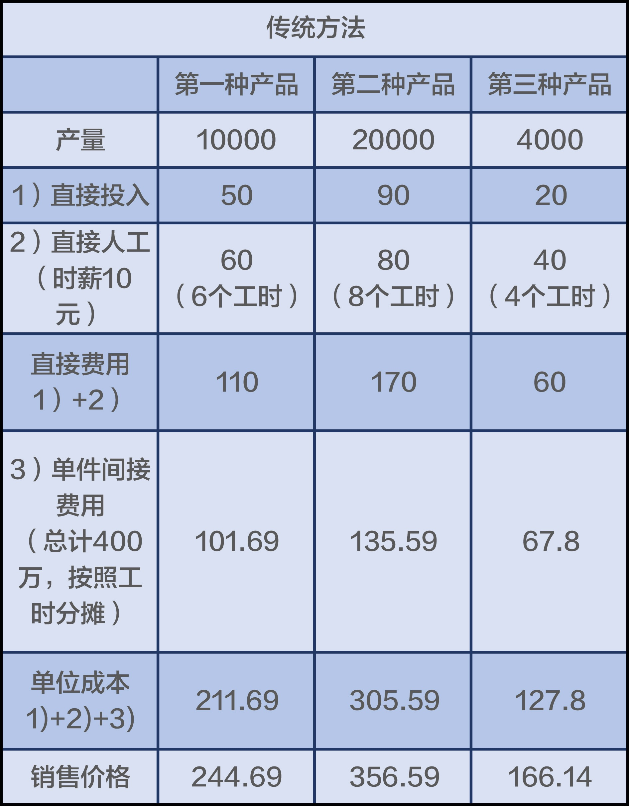
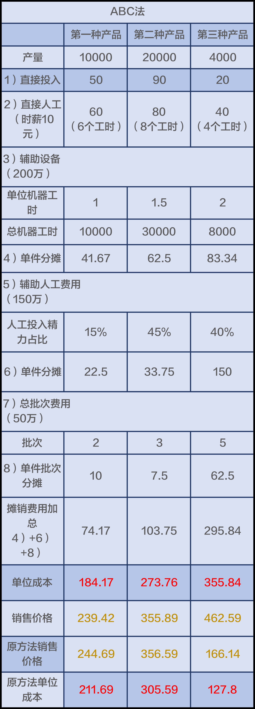
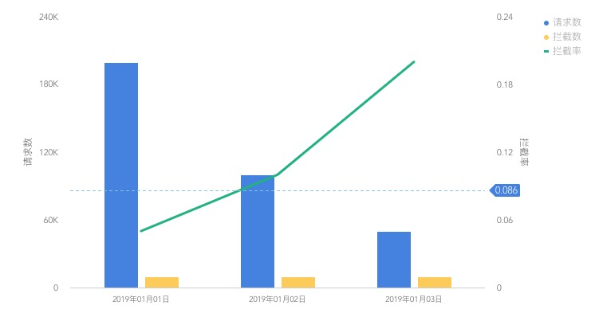
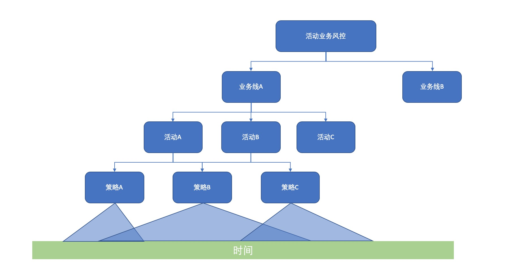

#### 制造业成本核算案例

我第一次感到成本核算的重要性，是来自于《宁向东的清华管理学课》里提到的一个例子。

_推荐大家订阅这个课程，干货十足_

某家企业在核算成本时，长期采用直接成本、直接人工，再加上分摊间接费用的方式来计算总成本。直接成本，主要是生产某一种产品的材料费，特别清楚，特别直接，不会记错到不同的对象上。直接人工，也是类似的情况，可以算得特别准确，花了多少人工，都会记得非常清楚准确。直接成本加上直接人工，可以被称为“直接费用”。

与直接费用相比，间接费用就不是能够核算得特别清楚，比如一些辅助设备的折旧。在这家企业，制造三种产品时都会用到相同的辅助设备，和一些共同的支持和辅助人员，这些形成了一些费用，另外，在产品更换批次的时候，也会发生一些费用。你可以将这种批次转换所发生的费用，想象成因为客户对象不同所形成的费用。这些费用的总和，统称为“间接费用”。

我们案例中的这家企业，长期以来采用的间接分摊方法是按照人工的工时来分摊的。为什么要这样分摊呢？因为他们的企业是劳动密集型企业，人工工时的效率长期以来被认为是衡量企业效率的重要方面。于是，就有了今天文稿中的第一个表格。每一种产品的成本是从上至下一路加下来。然后，经营者按照成本加成的方式来确定目标售价，在所核算的单位成本基础上，加上一个30%的利润加成，就形成了最后的市场定价。

这种定价的方法，叫做成本加成定价法，是很多企业算账的时候很自然使用的方法。不过，使用这种方法，逻辑上成立的前提，就是你的成本核算是对的。如果成本核算不对，那后边的事情就全不对了。

那么，这种成本核算的路子对吗？其实不对。为什么呢？理由有三条：
1. 这家企业生产三种产品的时候，共同使用那些辅助机器，但是，该如何计算分摊成本？应该按照机器工时来核算，而不应该用人工工时，因为机器工时和人工工时是不一致的。用不同的标准来做分摊基数，得出来的数字是不一样的；
2. 批次会引发一些费用，这些费用应该按照批次去摊销，跟人工工时完全没有关系；
3. 辅助人员所发生的费用（请注意，这里是辅助人员，而非生产某一件产品的骨干人员），基本上要看他究竟在每一种产品上花费了多少时间，然后按照时间的比例再去分摊相关的费用。

重新核算后的结果如下图

可以看出第三种产品的单位成本和销售价格发生了巨大变化。重新计算后你才会发现一件成本是355元的产品被算成了127元；一件应该卖462元的商品被用166元卖出。第三种产品实际一直是亏本在售卖。

### 向细节要效率

这是一个传统制造业的例子，但是思想是一样的。当我们无法看清一件事情的细节的时候，是无法找到问题、改正问题、提高效率的。

### 一个分析案例

会员活动，例如抢红包、邀请、抽奖，在每个公司都是很常见的。你会如何评价会员活动风控策略的表现？

1. 按照业务线进行评估，例如社交业务、游戏业务
2. 按照每次活动进行评估

| 时间     | 业务 | 活动       | 请求数    | 拦截数   |
|--------|----|----------|--------|-------|
| 19-1-1 | 游戏 | 下载送金币    | 200000 | 10000 |
| 19-1-2 | 游戏 | 下载送金币    | 100000 | 10000 |
| 19-1-3 | 游戏 | 下载送金币    | 50000  | 10000 |
| 19-1-1 | 游戏 | 签到15天领红包 | 500    | 5     |
| 19-1-2 | 游戏 | 签到15天领红包 | 450    | 15    |
| 19-1-3 | 游戏 | 签到15天领红包 | 700    | 60    |
| 19-1-1 | 社交 | 上传视频送金币  | 10000  | 150   |
| 19-1-2 | 社交 | 图文审核     | 14000  | 5000  |
| 19-1-3 | 社交 | 图文审核     | 20000  | 7000  |

游戏业务下的下载送金币活动拦截率大约是.086，对比了一下该业务历史经验，假设是0.8，似乎没什么异常。

这就犯了一个常见错误：**缺失了时间维度**

如果将时间考虑其中，你会发现3天拦截率分别是是0.05, 0.1, 0.2。仅从数字来看，第一天和第三天都离均值0.086相差甚远。

拦截率偏离了我们的经验，肯定出问题了，是吗？不一定。

**做风控一定不能只看宏观数据，而缺少策略的分析。**

| 策略          | 置信度或分数(0-100) | 命中次数 |
|-------------|---------------|------|
| 单IP每秒请求100次 | 50            | 2    |
| 单IP每秒请求200次 | 100           | 0    |
| 黑名单策略       | 70            | 10000 |

我们深入到游戏业务下的下载送金币活动的风控策略中看一看，假设有3条策略：
1. 两条高频策略，第二个阈值更高
2. 一条黑名单策略

你发现了什么？所有人都命中了黑名单策略！换句话说，这个业务基本就是靠着黑名单来防御攻击。同时我们还可以提出更多的问题：
1. 为什么高频策略没有命中？因为阈值太高了吗？需要下调吗？
2. 第一天请求数达到了20万，为什么每一天都只命中了1万黑名单？因为黑名单积累量不足吗？

要解决这些问题，我们需要更深入的分析原始数据。例如
1. 黑名单每日增量如何？
2. 黑名单过期时间如何？
3. 黑名单是游戏业务来的吗？

### 分析案例总结

将上文提到的整理一下大致如下图

当然在实际中，你可能会
1. 变动每一层的顺序
2. 增加其他维度，例如客户端类型（Web、Windows、iOS、Android）
3. 将策略层分为多个策略层

无论你如何分层，你会发现越上层越难看清事实真相，风控评估结果越有可能出错。但是底层向上层抽象时，平均、求和等计算逻辑是必要的。只是你要时刻记得这种抽象会丢失很多细节。

#### 上的去，下的来

接下来谈一谈怎么办。我个人的总结是：**上的去，下的来**
