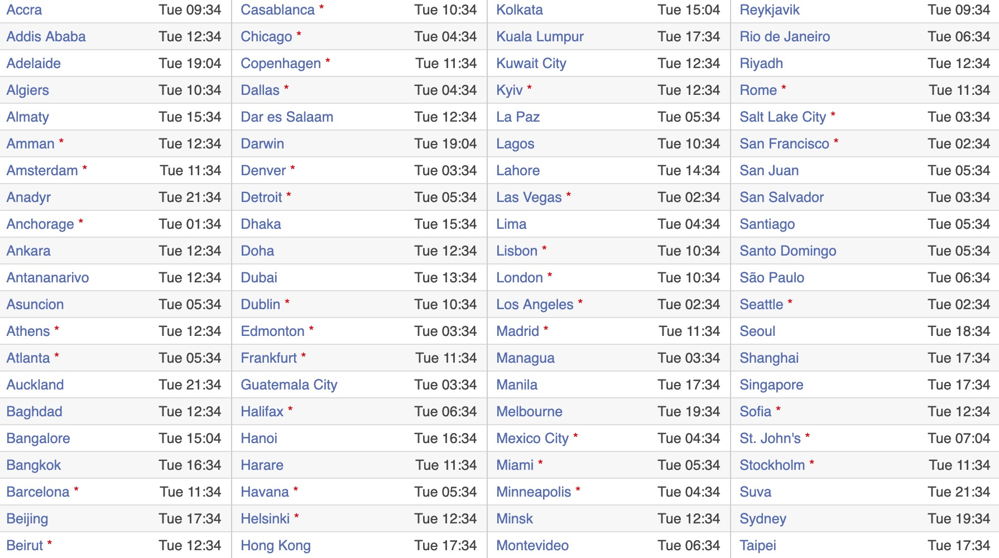
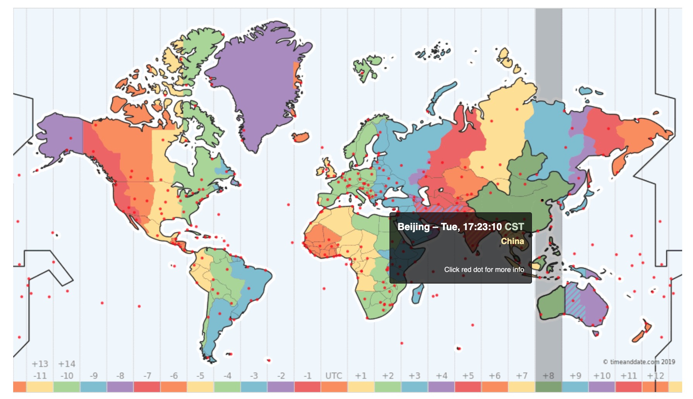

# 决策的核心问题-看得清

前文提到解决“看得清”这个问题，也就是解决数据的理解问题，分为2个子问题：
1. 能否制定合理的核心指标，从而化繁为简、提高运营效率？
2. 能否建立合理、灵活、快速的可视化体系，从而提高人的理解？

### 制定合理的业务核心指标

| 名称 | 适用业务 | 目的 |
|---|---|---|
| 请求量 | 大部分业务 | 检测高频攻击 |
| 各端请求比例 | 大部分业务 | 检测针对某一个端的高频攻击 |
| 二次验证通过率 | 启用二次验证的业务 | 检测暴力破解验证的情况、检测二次验证是否有故障等 |
| 密码错误率 | 密码验证业务（例如密码登录） | 检测暴力破解 |
| 参数（例如User-Agent）伪造率 | 大部分业务 | 检测请求伪造 |
| 某个近实时聚类算法的结果 | 个别业务 | 检测某个模式的流量是否异常 |

上面列了几个常见的指标，我们应该选择看哪个指标呢？

都看可以吗？当然可以，但是没必要。在爱奇艺我设计了一个系统叫“深度分析”，说起来也简单，就是输入一批用户，看这批用户在爱奇艺所有的行为指标。最后结果有好几页。要是每个统计认真看过去，可能要花3-5分钟才能看完。实际上如果真的是攻击，靠其中1-3个指标就已经可以大致定性了。

如果我们称这1-3个指标为核心指标，那是哪几个呢？答案是要看是什么业务风险，不同业务不一样。例如密码尝试次数和错误率是一个不常用的指标，绝大多数问题不会考虑这个指标。但是在撞库问题中，就成了核心的指标，需要重点关照。

所以对于你自己的业务，要思考一下你最关心什么，哪些指标可以带来更多信息。然后把重心放在这些核心指标上。

其他指标就不需要了吗？不是的，在给出最终判定前，最好再花一点时间看看其他指标。主要是为了看看还有没有别的可能，避免确认偏误(Confirmation Bias)、后见之明偏误(Hindsight Bias)等心理偏误。

>It is easier to construct a coherent story when you know little, when there are fewer pieces to fit into the puzzle. Our comforting conviction that the world makes sense rests on a secure foundation: our almost unlimited ability to ignore our ignorance.
>
>Kahneman. Thinking, Fast and Slow

### 建立合理、灵活、快速的可视化体系

当你确定了业务风险，量化并制定出了核心指标，于是就可以利用机器对业务进行自动化分析和监控了。但是除了让机器理解你的问题，人也得理解。这个时候可视化能力就很重要了。

可视化不仅可以加快对数据的接受速度，也可以加深对数据的理解。

拿当前世界各地的时间信息为例，普通的表格可以提供完整的信息。通过筛选也可以快速找到某个城市的时间。但是却很难宏观的理解数据，发现城市和城市之间的关系。

将信息通过时区地图可视化出来之后，就变得更容易理解。例如你可以看到中国全境采用的是北京时间。但是美国本土区分了好几个时间。

关于可视化，我建议使用一些BI工具提升效率，例如
* [BDP](https://www.bdp.cn/home.html)
* [Tableau](https://www.tableau.com/)
* [Apache Superset](https://superset.incubator.apache.org/)

只有BI工具方便还不够，如果BI工具依赖的引擎不够快也是没用的，所以接下来着重说一下大数据工具，例如Hive、Spark、Kylin、Impala之类的。对于重要的指标，如果想加快分析的速度，可以从3个方面入手：
1. 内存换时间，例如使用Spark、Impala这里基于内存的分析引擎。内存比硬盘贵，但是速度快
2. 空间换时间，例如Kylin
3. 提升工具的使用性（人力换时间），例如Zeppelin

这里主要从工具角度来介绍，首先是因为方法论较为抽象，一下难以理解，工具是方法论的具象化延伸，易于理解和落地；其次是提升工具确实可以大幅提升效率。
