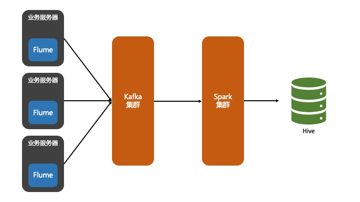
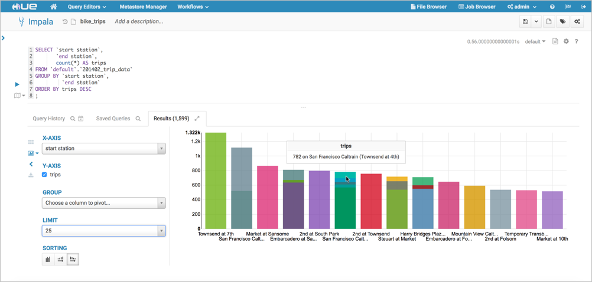
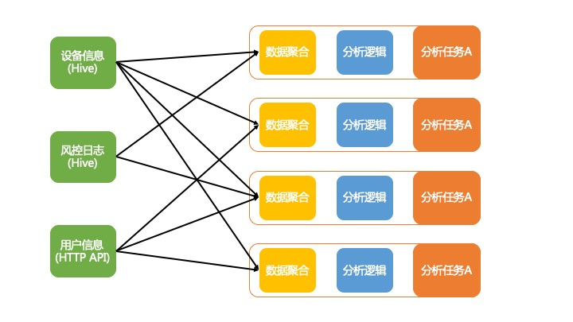
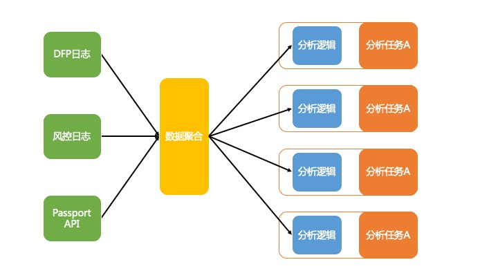

# 决策的第一步-看得见

开篇提到解决“看得见”这个问题，也就是解决数据的获取问题，分为3个子问题：
1. 数据是否被存储了？
2. 数据能否可以被快速、灵活的访问？
3. 数据能否可以被关联分析？

### 数据的存储

请以自己的网站或应用为例，试着回答一下这几个问题：
1. 你的网站或应用的登录失败率是多少？
2. 登录量上升 + 登录成功率下降，让你很紧张，那么你是受到攻击了吗？

要回答上面的问题，至少你要有登录日志，我相信大部分公司都会存。但如果你只存了登录日志，而没有存验证日志，那你就很难回答第2个问题了。下面这2种可能都可能在特定时期导致登录量上升 + 登录成功率下降
1. 黑产真的来撞库了
2. 验证码服务升级，提高了验证难度


所以，如果你的数据一开始就没有被存下来，那么你就真的只能靠猜了。

### 数据的访问

除了存日志，你的日志还加了充足的字段，例如：IP、时间、验证码类型、验证码服务版本、客户端版本、设备号等等。这很好，给未来的分析开了个好头。可是这也带来了问题：**我增加了日志，增加了字段，我的业务很好，可是数据量太大了，我用excel打不开**

这里的excel是一个比喻，但也不是个比喻。

随着数据量增大，要想访问数据就需要大数据工具，例如Hive、Spark、Hbase、Cassandra、Elasticsearch。我相信稍微大一点的公司都有使用。但是 **使用大数据技术不代表数据可以被快速、灵活的访问。**

我见过拥有完备大数据体系的公司里，不少运营同事却无法方便的获取数据，只好请工程师导出数据样本后，本地excel人工分析。

#### 常见问题一：数据没有被整理

很多重要的业务数据混杂在一个大的日志文件中，例如这样产生的日志

```
System.out.println("user " + userId + " logged in at " + time)
or
Logger.info("user {} uploaded a photo at {}", userId, time)
```

用户行为虽然记录到了日志中的，但是不同行为日志混在一起，甚至还包含代码的报错堆栈信息。如果日志格式没有规范，事后想要排查问题都很难，更不要提做分析。

常见方案：有价值的日志应该按照便于后期处理的格式打印到单独文件中。然后使用Apache Flume + Kafka + Spark转存到Hive中。



#### 常见问题二：分析师没有入口可以查询

我见过太多的系统工程师忘了一件事情：**不是每个人都会编程**。

数据应该可以让团队中每一个需要的人方便获取到。通过ssh登录到服务器上，使用命令行读取很明显不是一个方便的方式。特别是当命令行查询出的数据是JSON格式时，大多数人都会是一头雾水。另外，使用Spark查询数据也不是一个好的方式，除了要写代码，spark代码发布到集群、启动任务都需要花不少时间，这会浪费分析师大量的时间。

常见方案：搭建或者开发GUI查询工具，不需要很漂亮，但要方便。这里推荐工具Hue。



### 数据的关联分析

数据量大了以后，数据之间的关联分析就变得困难。

#### 常见问题一：存储不一样

基于业务的不同特性，数据可能会存在不同类型的数据库中，MySQL、MongoDB、Cassandra、Hbase等等。虽然你依然可以使用Spark从不同存储中读出数据，在内存中关联分析。但是如前文所述，不是一个易用的方案。

常见方案：采用统一数据仓库，例如Hive。每天将其他数据库中的数据同步到数据仓库中。

#### 常见问题二：数据量大，关联耗时长

数据量大了以后，一条Join语句可能需要运行很久。

常见方案比较多，例如：
1. 对数据合理分区
2. 成本换时间。采用基于内存的分析引擎，如Impala、Presto
3. 抽象数据聚合层，如果Join数据长耗时不可避免，那就避免重复进行。说直白一点，热数据提前Join，冗余常用的分析字段，构建大宽表。





### 总结

我认为所有的决策都要先解决“看的见、看得清”这个问题，而“看得见”是基础。首先需要我们合理设计数据内容，其次需要我们选取合适的数据存储分析技术。都不是容易的事。
