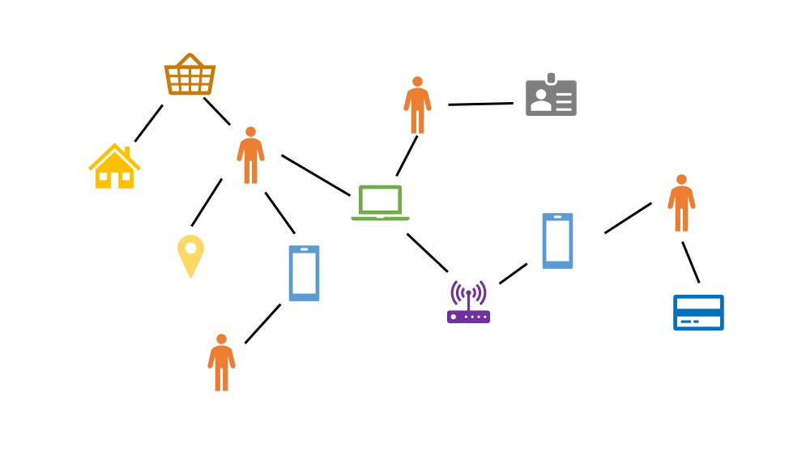
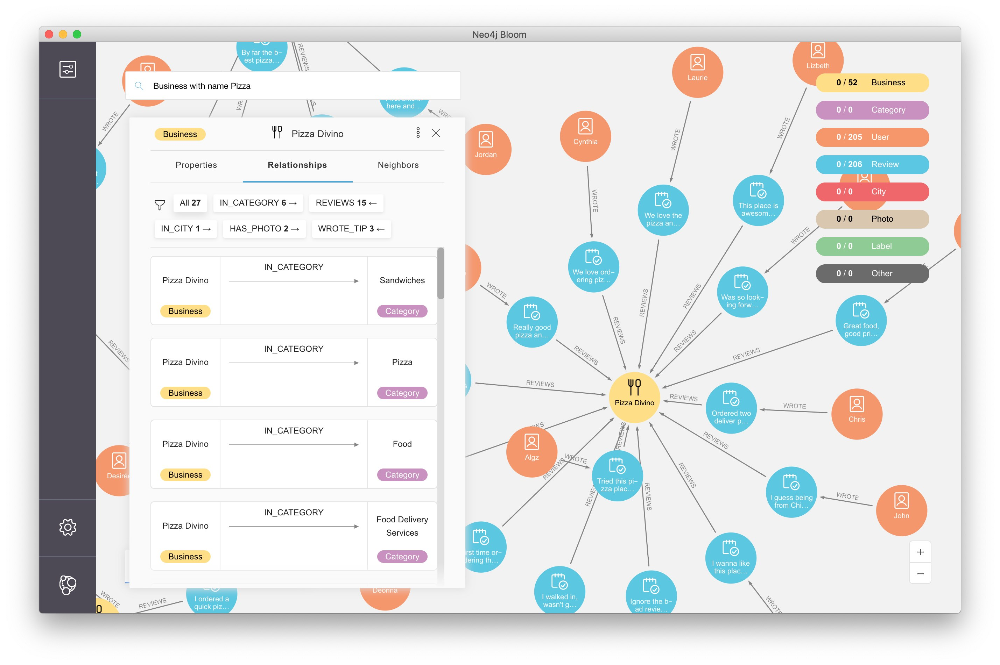

# 图和图数据库技术

学过数据结构读者肯定对“图”这个概念不陌生，图由节点和边组成。数据结构课程也介绍过“深度优先搜索”、“广度优先搜索”、“Dijkstra算法”等概念。本章介绍的图数据库就是保存图结构，并支持图算法的一类数据库。

在很多业务中，实体和实体存在丰富的关系，例如用户和订单、订单和银行卡、用户和地址、银行卡和发卡行之间都存在关系，如果将这些实体通过关系全部连起来就成了图。如果使用MySQL之类的数据库实现这一业务模型时，需要建立不同表，然后通过各个表的主键关联起来。当我们想顺着关系查询数据时，需要写子查询或者join来实现，有时需要嵌套多个子查询或者join，甚至还需要临时表来存储中间结果。

使用图数据库，并不是为了改善逻辑上的业务模型，图数据库的优点是可以保持业务模型和数据库模型的一致，查询时更方便。

## 图的应用

图更强调关系，而不是每个独立的实体。所以在关系更重要的场景中会更有用处。

类似波音这样的大企业，供应链涉及全球多个国家、上百家公司、上千道工序，除了单个环节，环节间的关系、资源的流动状态也很重要。

使用图数据库可以更自然的表达和分析这种复杂关系。

图的另一个主要应用场景就是风险控制。因为很多时候我们需要：
1. 顺藤摸瓜找到风险发生的根本原因或者主体，例如电信诈骗中顺着钱在不同账户的流向来确定犯罪嫌疑人
2. 挖出团伙，例如使用同一IP地址的可疑账号
3. 当单个实体信息较少，无法判断风险的时候，利用其相关实体来辅助判断，例如金融借贷

在风控业务中可以构建关系的实体有很多：用户、设备、地址、银行卡、身份证、IP、WiFi等等。你可以把所有实体都包含在一张图里，也可以选你关心的维度，取决于你的业务需要。

## 图数据库常见功能

说到图数据库的功能，很多人第一反应都是酷炫的可视化查询。选择一个人，唰唰的就和他相关的所有人都显示了出来。没错，图的可视化功能非常酷炫，也非常重要。下图就是neo4j数据库的可视化界面。

在可视化的底层，是图增删改查功能，这也是数据库最基本的功能。只不过对于图数据库来说，你操作的是节点和边。除了深度/广度优先搜索算法外，还有最短路径、page rank等算法，满足图特有的查询需求。

作为数据库，很多图数据库也支持事务、Restful API、sharding、备份等功能，不过本文意在科普，就不再过多论述图数据库的技术功能了。

## 图数据库有哪些？

目前市面上有不少图数据库，简单列几个：

* Neo4j：名气最大，历史悠久、技术成熟、使用方便，但是分布式版本不开源
* OrientDB：3.0版本以上可用性很好、bug不多、API方便、自带的可视化可以应对简单分析工作、开源版本也支持分布式，目前还在快速发展
* JanusGraph：底层可以选择ES、HBase、Cassandra等分布式技术作为支撑，理论可以存储更多数据（节点、边等），个人认为还不成熟，API很多不合理，没有易用的开源可视化方案
* TigerGraph：商业产品、功能齐全、可视化强大，但价格估计不便宜
* Dgraph：比较新，读者可以自行调研

另外，Spark Graphx其实不是图数据库，而是图计算引擎。
