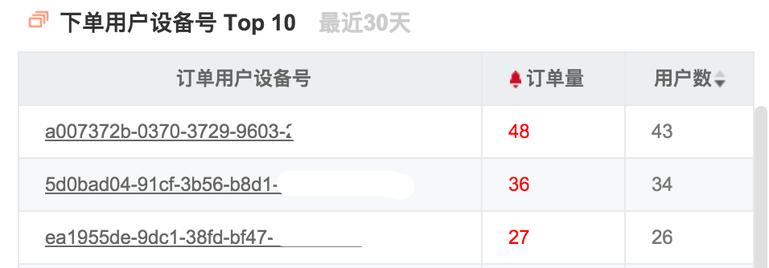
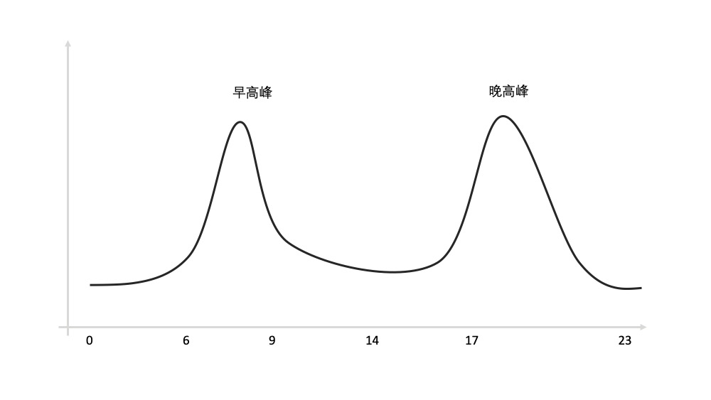
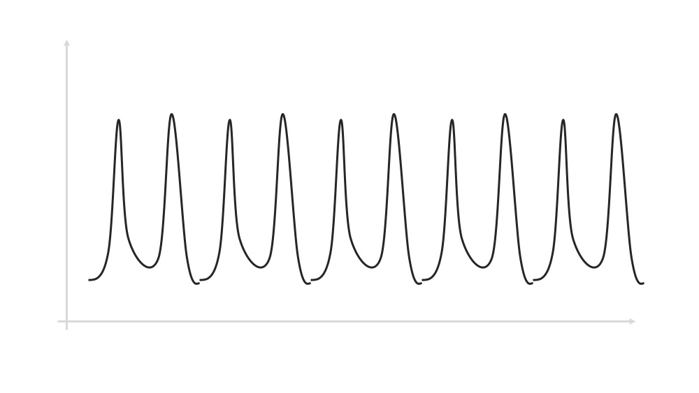
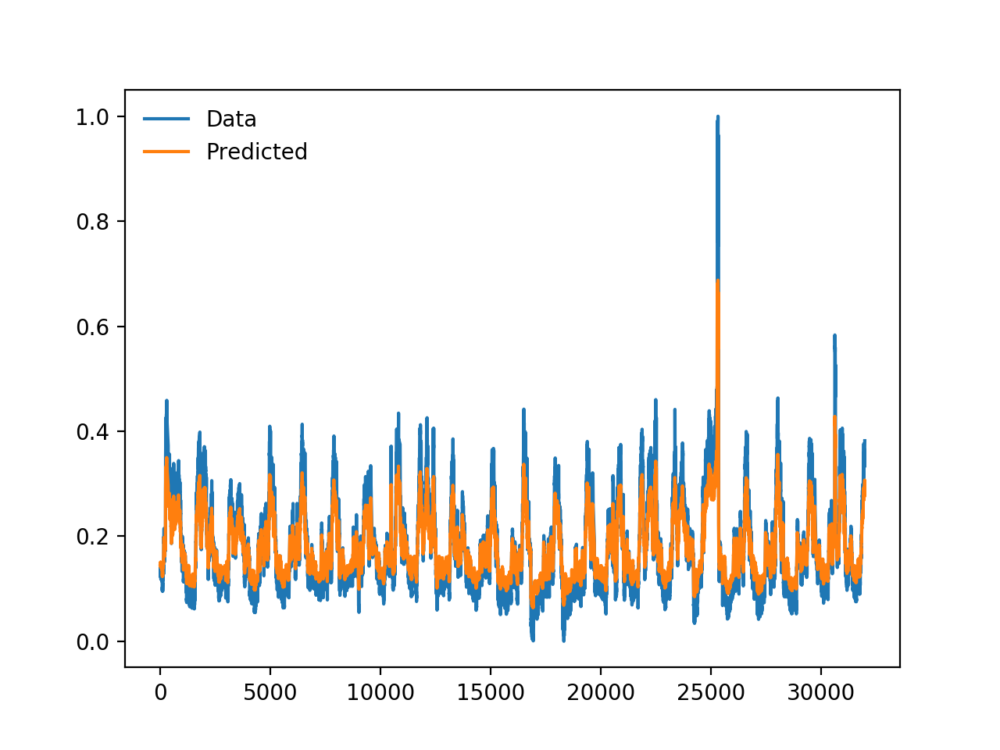

# 异常发现

风控的运作过程中，第一个需要了解的是“异常发现”。不是因为它最简单，而是因为
1. 大部分时候异常发现是风控工作的起点
2. 异常发现是非常重要的一步，风控大量系统、算法、时间都和异常发现有关。这一步就像是提出一个问题。如果你提不出问题，也就谈不到解决问题；其次，提出一个好问题可以让你更快的解决问题。准确的发现异常，就是提出一个好问题

异常可以有很多，例如：
1. 昨天凌晨1点的订单比均值高
2. 今天注册用户数突然上升
3. 昨天验证码的请求量上升

## 建立监控

怎样发现异常呢？最容易想到的是做一个统计图表。这个确实是必要的。

用一个我真实用过的表格来距离，这个表格是为了监控刷单。这个表格统计每个设备登录过的用户数和下过的订单量。



一般一台手机只会被一个人使用，一个人一般在我们公司只会注册一个账号（不同业务具体分析，例如我妈注册了多个QQ号，因为她在玩斗地主，一个账号的欢乐豆不够），上图中可以清晰看出三台设备登录了几十个用户，人均下一单，符合刷单的情况。那么这就可以作为突破口继续查下去。

图中对可疑的数据会自动高亮，方便运营发现异常。当然了每天看表格比较麻烦，所以我们还会推送报警到管理员的手机，方便我们尽快解决问题。

除了对设备号做聚合统计，你还可以用IP、UID做聚合统计，当然也可以结合好几个一起聚合统计。如果你学过SQL，大致可以想到就是调整一下group by的字段，似乎很简单。

```
select ... group by device
select ... group by device, ip
select ... group by device, uid
select ... group by ip
select ... group by ip, uid
select ... group by uid
select ... group by device, uid, ip
```

可是当真的开始写SQL的时候就陷入了崩溃，因为：
1. 日常需要监控的维度有很多，选哪几个呢？
2. 多个维度的组合太多了，如上面的示例，如果想把device、ip、uid三个维度组合都统计出来，需要写7条SQL，如果维度再多一点，会很麻烦，很容易出错

这个时候我们就可以借助一点算法了。

## 使用频繁项集(Frequent Pattern)发现异常

首先介绍一个简单、上手容易的算法——频繁项集。

Frequent Pattern 可以理解为频繁出现的特征组合，例如在你的订单记录中来自IP 13.67.233.10 且安卓设备就是一个Pattern，如果这个Pattern频繁出现，例如超过总请求量的10%，就值得我们关注了。

听上去和刚才介绍的SQL是一回事，但是使用FP-Growth之类的频繁项集挖掘算法，我们只需要指定所有需要分析的维度即可，而不需要人工将它们排列组合。

具体的实现可以使用[Spark ML FP-Growth](https://spark.apache.org/docs/l客户端IDest/ml-frequent-p客户端IDtern-mining.html#fp-growth)

假设我们指定要分析的维度有api、UA、IP、客户端，使用Spark ML FP-Growth计算，重新将产出的结果格式化之后，类似这样：

| Pattern                                                                                                                                                                                                      | Pattern 计数 |
|--------------------------------------------------------------------------------------------------------------------------------------------------------------------------------------------------------------|---------------|
| ip-223.88.67,,rf-https://www.baidu.com/api,,ua-Mozilla/5.0 (Windows NT 6.1; WOW64) AppleWebKit/537.36 (KHTML, like Gecko) Chrome/63.0.3239.132 Safari/537.36                               | 7198          |
| api-/apis/reglogin/login.action,,ip-223.88.67,,ua-Mozilla/5.0 (Windows NT 6.1; WOW64) AppleWebKit/537.36 (KHTML, like Gecko) Chrome/63.0.3239.132 Safari/537.36                                              | 7198          |
| 客户端ID-1,,ip-223.88.67,,ua-Mozilla/5.0 (Windows NT 6.1; WOW64) AppleWebKit/537.36 (KHTML, like Gecko) Chrome/63.0.3239.132 Safari/537.36                                                                         | 7198          |
| ip-223.88.67,,ua-Mozilla/5.0 (Windows NT 6.1; WOW64) AppleWebKit/537.36 (KHTML, like Gecko) Chrome/63.0.3239.132 Safari/537.36                                                                               | 7198          |
| 客户端ID-1,,ip-,,ua-Mozilla/5.0 (Windows NT 6.1; WOW64) AppleWebKit/537.36 (KHTML, like Gecko) Chrome/63.0.3239.132 Safari/537.36                                                                                  | 6973          |
| api-/apis/reglogin/login.action,,客户端ID-1,,ip-,,rf-https://www.baidu.com/api,,ua-Mozilla/5.0 (Windows NT 6.1; WOW64) AppleWebKit/537.36 (KHTML, like Gecko) Chrome/63.0.3239.132 Safari/537.36 | 6836          |
| 客户端ID-30,,ua-Some Client PC 6.7.82.6548                                                                                                                                                                    | 6702          |
| api-/apis/reglogin/pc_login.action,,ua-Some Client PC 6.7.82.6548                                                                                                                                       | 6702          |
| ua-Some Client PC 6.7.82.6548                                                                                                                                                                           | 6702          |
| api-/apis/reglogin/mobile_login.action,,客户端ID-34                                                                                                                                                                | 6282          |
| 客户端ID-34                                                                                                                                                                                                        | 6282          |

实际应用中，频繁项可以作为核心，直接展示或者报警出来。也可以作为其他分析的第一步，需要结合业务进行设计。

## 时间序列检测

除了通过请求频率判断是否有异常，还可以通过请求的时间序列来发现异常（异常不代表有攻击）。

时间序列可以理解为指标随着时间变化的规律。用地铁客流量来举例，一天中客流量应该类似下图，会有明显的早晚高峰。



假设不考虑节假日，将多天的数据连起来看，差不多如下图。有明显的波动规律。所以如果某一天实际客流量不符合这个规律了，大概率是发生了什么事情，例如附近在举办大型的展览。



### LSTM

简单的频率比较容易识别，使用SQL或者某种计数系统就可以实现。但是这种时间序列的异常应该怎么识别呢？这就要提到最近几年被广泛使用的LSTM模型。

Long Short Term Memory(LSTM)是 递归神经网络（Recurrent Neural Network）的一种，具体的原理可以自行Google。这里你需要知道的是使用LSTM可以很方便的对时间序列进行检测，特别是使用TensorFlow 2.0。

下图是使用TensorFlow预测的结果。



具体例子可以参考[TensorFlow 时间序列预测](https://www.tensorflow.org/tutorials/structured_d客户端IDa/time_series)的例子。
