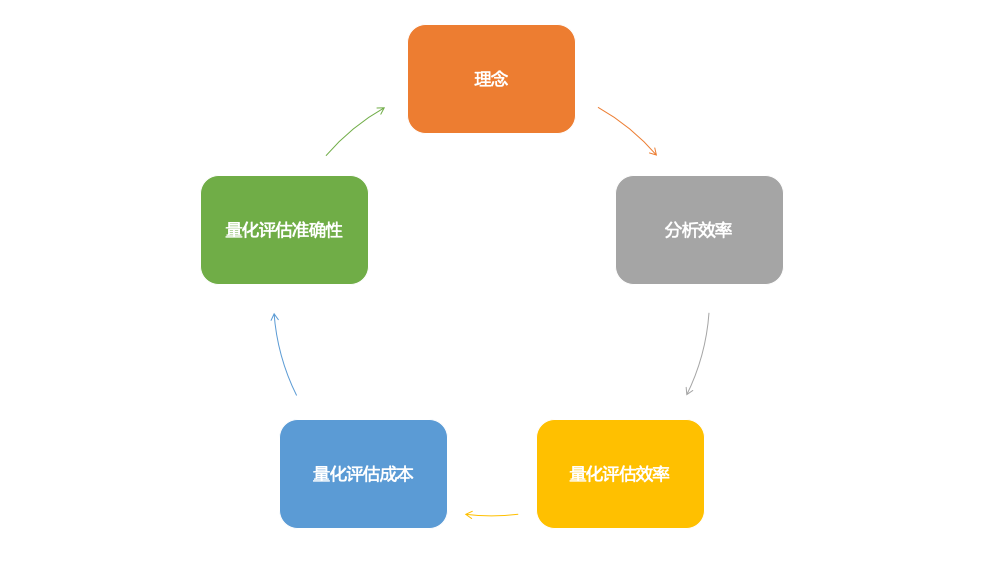

# 影响量化评估的两个要素

前文介绍了“看得清”，你可能会想，看得多清才算是清呢？多清才足够呢？本文就聊一聊影响量化评估的两个要素。

### 一个案例

```
HR老板问：这个月招聘工作咋样啊？
HR：招了3个人（可计数的实物）
HR老板：对业务有什么帮助吗？（抽象的价值）
HR：帮助挺大的，解决了那个团队没有前端开发的问题
HR老板：我是问你价值，对项目有啥帮助吗？
HR：因为招的是还没经验的实习生，这个月还没什么明显产出，老员工带新员工自己效率还降低了，影响了项目进度
HR老板：你的意思是负价值吗？
HR：以后培养好了，肯定对团队有帮助的（一件事往往包含短期价值和长期价值）
HR老板：这个帮助的价值是多少？
HR：那个项目以后做完了可以盈利1个亿，没有这几个人，肯定做不完。招聘的价值就写1个亿吧。（确实能找到关联的数字）
HR老板：这怎么行？！哪部分是这几个新员工做的啊？
HR：我让他们写日报给我，让他们写清楚每个人产生的价值（写日报增加了成本）
实习生：我也不知道我做了个页面的价值啊，我觉得这个页面挺重要的，要么就5000元吧。
HR：隔壁团队花了3天做的页面，和我说5000元。你这个就花了一个上午，怎么就5000？（基于投入成本来评估价值）
实习生：两个系统不一样啊，这个系统用了新的技术，运行更快了。（基于效果来评估价值）
HR：更快了也不值这么多吧，你再想想（价值评估难以达成一致）
```

这里不是要黑HR（爱奇艺的HR、行政真的特别好），只是招聘是一个十分常见的事情，希望每个读者都可以理解量化评估的难点。大致有：
1. 很多事情的价值是长期的，短期价值不明显，甚至有可能是负的。预测未来的成本很高，甚至是不可能的
2. 很多事情的价值是通过价值网络产生的，也就是说一件事情本身独立存在时是没有价值的，当加入到另一个网络时就会产生价值，很难说一个节点的加入可以增加多少价值。例如一名出租车司机加入网约车平台，对平台的价值。
3. 即便是同一个功能，不同人也会有不同的价值感受

概况来说分为两类。首先是量化评估受到成本的制约，其次是价值评估难以达成一致。接下来一个一个解释。

### 制约量化评估的首要问题是成本

KPI刚刚在国内流行的时候，我参加过一个公司培训。

>讲师：KPI一定要可以衡量，不能是模糊的。例如“实现增长”就不是一个好的目标。
>
>某位同事提问：我觉得有时候我做的事没办法评估，怎么办？
>
>讲师：肯定是有办法评估的，没有什么是不能量化的。你不能量化是你没有好好思考。

这位同事还是一脸疑惑，但再接着问就很尴尬了，因为讲师的意思是“你不能是你水平不够”，再问问题更显得自己水平不够，而且还显得自己不愿意动脑。

之后的几年我一直在思考“没有什么是不能量化的”这句话，直到学了经济学之后，我得到的结论是：**我不知道世间万物是不是都能量化，但是我确定量化是有成本的**，很多时候还是容易被人忽略的交易成本。

拿量一个物品的长度为例。做一张桌子，你需要控制桌子腿的长度，用卷尺量误差在1-2毫米，这就足够了。但在生产线上生产iPhone，为了保证原器件长短误差在千分之三毫米（芯片要在纳米量级），就需要花大量的钱去提升工艺技术了。

如果没有成本这个因素，很多事情上人们可以为所欲为。但正因为有成本这个因素，所以：
1. 即便我们很有钱，也不会用顶级数控机床去做张桌子，因为成本太高了，不划算
2. 大家都想生产利润很高的高端产品，但是没有家家都是高端产品企业，因为成本太高了，体现在买不起高端产品的生产机器，或者雇不起高端产品的专家

不只是测量物体，衡量工作也是同理。量化评估需要调研、记录、分析、汇总，首先是需要花时间。特别是当评估需要依赖其他人或团队时（其他人又可能需要依赖其他更多的人），沟通讨论的时间更难把控。其次维护这套流程也要花时间，例如监督大家真的认真记录了工时。即便是采用自动化，开发和维护自动化系统也是需要花钱的。算一算量化评估的时间有可能已经超过了做事情的时间。

**成本限制了你会怎么做，成本限制了你能做什么。**

### 个人主义的主观价值论
我们的工作中除了量化实物，更多遇到的是量化做一件事的意义，或者说一件事的价值。
1. 你提出了一个创意的价值是多少？
2. 你帮助同事修复了一个故障的价值是多少？
3. 你开发了一套风控系统的价值是多少？

如果你在思考这个问题，实际上你正是在估值。你估值的依据是什么呢？别人的估值结果和你一样吗？接下来我们介绍一下“个人主义的主观价值论”的观点。

>主观价值理论（英语：subjective theory of value，简称STV）是经济学的价值理论，认为产品和服务本身并没有经济的价值，而是由于个人对它们的需求才有价值存在。而这些价值是依据购买者肯为此付出多少代价（如货币）来计算的。由于世界上每个人都有不同的需求和情况，因此，所谓“正确”的经济价值或价格在客观上是不存在的。
>
>  ————Wikipedia

主观价值理论认为：
1. 个人估值是个人的估值，不是集体的估值。集体不会感受，不会思考，也不会评估，做出个人估值判断的一定是个人。我们要知道集体不会做任何的事情，机构也不会做任何的事情，学校、机关、民族都不会做任何的事情。我们所说的，我们口头上喜欢说的哪个集体、哪个机构、哪个组织做的什么事情，其实最后都是个人做的。
2. 它是主观的，绝对主观的。并不存在什么客观的估值，如果没有了人，世界上的财富就没有价值，价值都是人赋予的。
3. 个人估值不是以个人的愿望为基础的，而是以他所愿意放弃的其他商品的数量来计算的。这是以行动为基础的，而这些行动是可以观察到的。

一瓶600mL的纯净水的价值是多少？对于电脑前的你来说，可能2元吧。但假设你身处景区里，这瓶水价格变10元了，你口干舌燥，你会买吗？你可能不会买，因为你觉得不值10元，可以坚持一会儿，出了景区再买。但同时你看到也是有人买的，说明有人的想法和你不一样，他们觉得这瓶水的价值大于10元。那么这瓶水的客观价值到底是多少呢？

主观价值论认为这瓶水的客观价值是不存在的。主观价值论认为你花不花时间、用了多少心思、花了多大的投资，这本身并不重要，最关键的是你能不能把它卖出去，你能不能适销对路，有没有人需要你生产的产品。在商品经济里面，是结果导向、需求导向，如果你生产的产品没人要，那么不管你投入多少资源，花费多少劳动，它也是不值钱的。所以主观价值论能够更好地指导生产，减少浪费。

### 总结
我的意思就是别量化了吗？不是的，量化评估很有用，是工作中很重要的一部分。

1. 从产品、策略迭代的角度来看：更好的理念可以优化分析效率，优化量化评估效率，优化量化评估成本，优化量化评估准确性，又可以给我们带来新的理念。当然了“正反馈”也意味着如果你做的差，就会导致链条中其他步骤做的更差，形成恶性循环。



2. 从资源配置角度来看：钱、人力、空间、时间资源是有限的，“我全都要”很多时候是不可能的。要想知道资源应该怎么分配、下一步怎么优化，就需要衡量手段，特别是衡量变化的手段。


>技术可以提高，但理论的极限无法突破，不要做徒劳的事情。
>
>我们所能做的事情，不过是在边界内找到相对好的答案。
>
>          ————吴军 《谷歌方法论》

参考
===
《薛兆丰的经济学课》第29讲：个人主义的主观价值论
