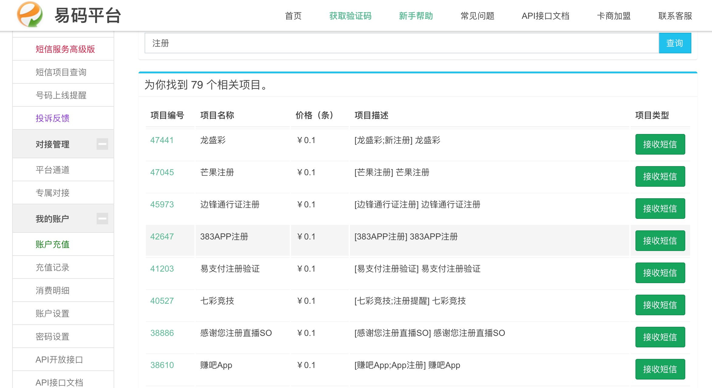
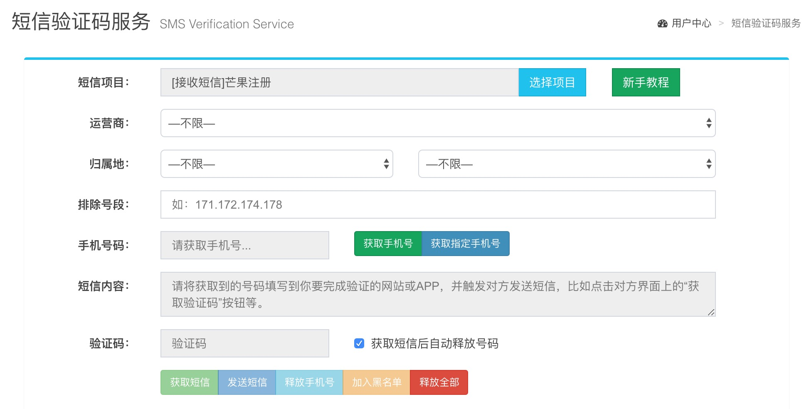

# 手机号风险识别（TBC）

上一篇已介绍了IP维度，这一篇聊一聊另一个常见的维度————手机号维度。

《中华人民共和国网络安全法》要求：

>第二十四条 网络运营者为用户办理网络接入、域名注册服务，办理固定电话、移动电话等入网手续，或者为用户提供信息发布、即时通讯等服务，在与用户签订协议或者确认提供服务时，应当要求用户提供真实身份信息。用户不提供真实身份信息的，网络运营者不得为其提供相关服务。

目前大部分APP至少采用手机号验证来完成实名制校验，都实名制了，总该很

