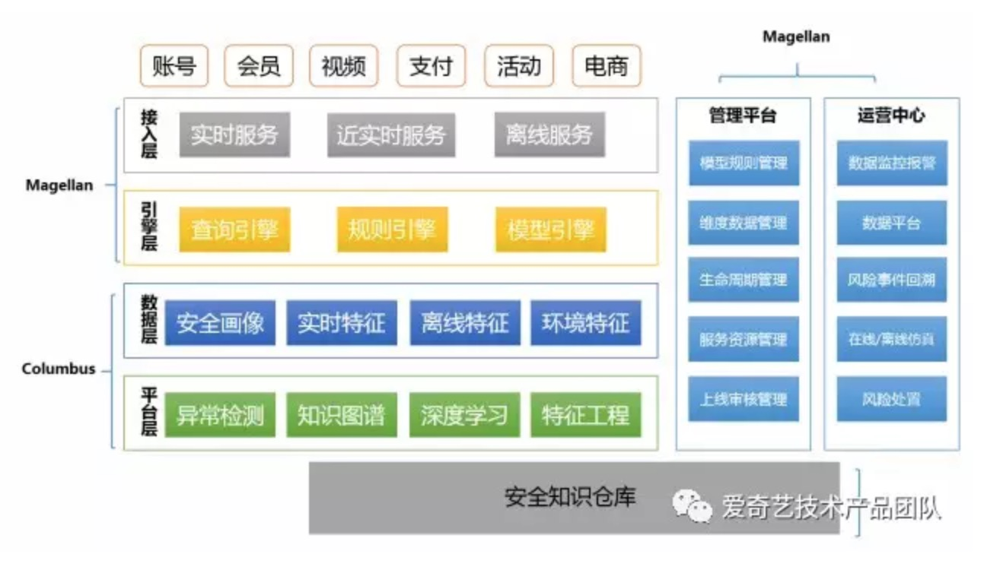
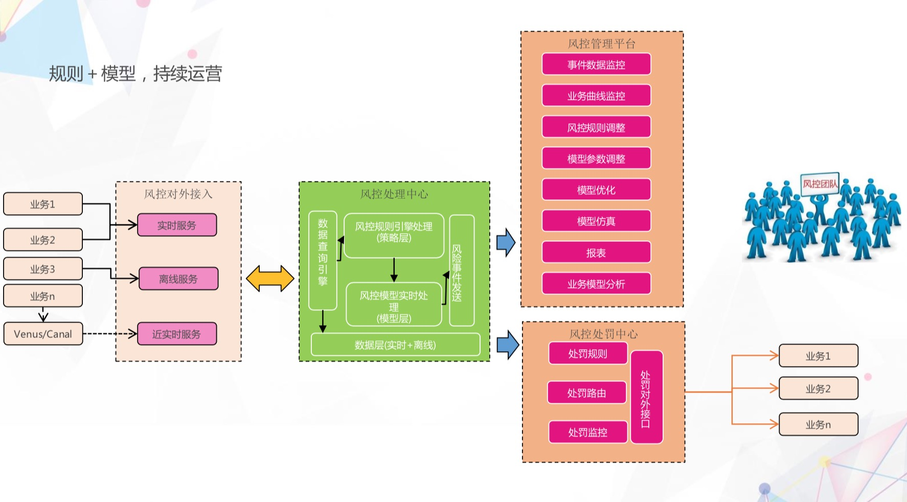
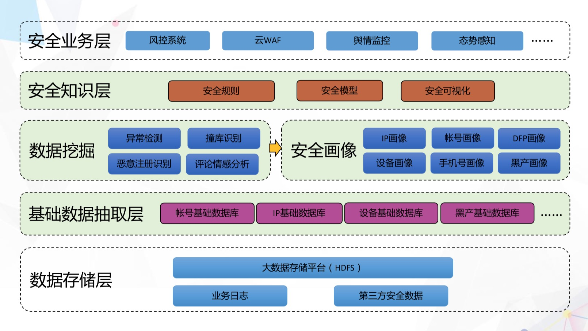
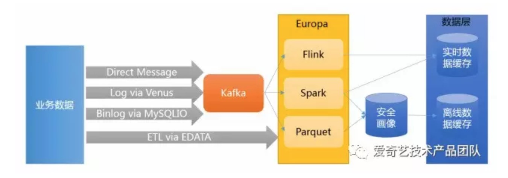
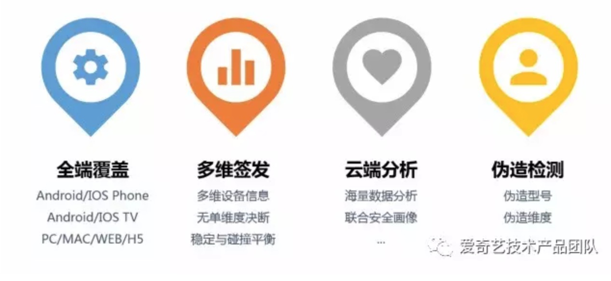

# 案例：爱奇艺业务风控系统

_以下内容取自于“爱奇艺技术产品团队”微信公众号、中国系统架构师大会、唯品会SRC城市沙龙的公开内容_

## 业务风险点

爱奇艺作为国内领先的娱乐公司，以下是爱奇艺安全团队需要应对的业务风险点

1. 会员：撞库盗号，账号分享，批量注册
2. 视频：盗播盗看，广告屏蔽，刷量作弊
3. 活动：薅羊毛
4. 直播：挂站人气，恶意图文
5. 电商：恶意下单，订单欺诈
6. 支付：盗号盗卡，洗钱，恶意下单，恶意提现
7. 其他：钓鱼邮件，恶意爆破，短信轰炸

## 问题——缺少统一完善的风控系统

一.各自为战
1. 各业务方多以安全事件驱动, 多数仅做事前单点防御, 经验数据无法共享
2. 单点防御容易被黑产各个击破,无法做到跨业务跨团队的联防联控
3. 低水平重复建设, 平台资源浪费

二.拍脑袋"规则"
1. 大量的风控规则是专家决策为主,阈值基本拍脑袋而定
2. 没有引入数据分析或者机器学习等能力,对事件本质缺乏足够认识及数据支撑, 造成正常用户误杀, 损伤用户体验, 导致用户流失

三.反应过慢
1. 不能快速识别攻击变化进行调整,无法进行积极对抗
2. 业务代码耦合,依赖业务开发, 测试和上线,占用业务排期
3. 某些前置/内置规则容易成为业务关键路径,对业务稳定性造成影响

四.手段单一
1. 可用特征维度不多, 严重依赖于IP, 公共出口误杀严重,引发投诉 2. 以限频, 限流, 黑白名单, 图文验证为主, 黑白名单难以维护, 无生命周期

## 解决方案

一.联防联控
1. 各业务联合, 在模型,规则,数据等方面进行共享, 联合布控协同防御

二.数据驱动, 智能对抗
1. 全站全网数据支撑, 基于数据进行决策
2. 利用机器学习实现智能异常特征发现

三.策略灵活, 有效对抗
1. 独立服务, 快速迭代
2. 支持业务的风险多样运营需求
3. 模型,规则, 策略快速实施, 快速反应

四.维度和拦截手段多样
1. 不依赖单一维度和单一行为
2. 云和端结合, 多种拦截手段应对

五.延迟可控, 低耦合可降级
1. 在实时风控场景下, 快速决策, 不能明显增加业务延迟, 自身有问题情况下, 不能影响业务

六.快速实现, 高效部署
1. 能够快速完成架构. 实现和持续迭代
2. 能够面向私有云的复杂拓扑, 快速部署

## 系统架构

我们的风控服务是由三大子服务组成：

*麦哲伦* 主要包括业务接入(接入层)，三大服务引擎(数据查询，规则执行，模型调用)，面向风控团队的管理平台(服务资源管理, 模型规则管理，生命周期管理，上下线管理，维度数据管理)，面向业务方的运营平台(风险事件管理，仿真，风险处置，监控预警，数据查询和仪表盘，规则清单)。

*哥伦布* 主要面向对业务数据的特征工程，大规模异常检测和深度学习，知识图谱，实时特征，离线特征，环境特征以及安全画像，并对外提供模型可实时调用接口或者模型输出缓存。

*郑和* 是安全知识仓库，是面向业务风控和其他安全控制所需的各类安全基础数据和威胁情报。

## 多渠道业务数据采集和处理

| 数据类型 | 技术选型 | 应用 | 延迟时间 |
| -- | -- | -- | -- |
| 实时数据 | Apache Flink | 图特征工程, 多维频次特征，多数据流Complex Event Processing | 毫秒级 |
| 近实时数据 | Apache Spark | 异常检测,流式特征工程 | 秒级 |
| 离线数据 | Apache Spark / Impala / Hive | 安全画像，用户画像，全业务数据 | 小时/天级 |

## 设备指纹

风控需要一个好的设备指纹的服务，要让所有的端都能够采集设备纬度，形成一个指纹，这个指纹多维签发的, 而且在云端会做大量的黑产分析，联合安全画像进行沉淀。

因为这些数据都是用户提供上来的，必须要做一个防伪的检测，从多维度数据里面查出提供的维度数据矛盾和不真实。

## IP识别（IP信誉分）

融合爱奇艺内部多个系统的数据, 参考第三方数据,综合衡量一个IP的长期行为, 得到一个-100到100的信誉分.

### IP信誉分特点

1. 分数制

使用-100到+100的分数，表示一个访问爱奇艺的IP的威胁程度，0代表中性；正分表示有威胁，分数越高越有威胁；负分表示无威胁，分数越低越无威胁。

不仅直观，同时业务方可以结合自己的业务，决定规则的松紧程度。

2. 引入负分

第三方情报服务，正常IP和无威胁情报的IP都是0分，无法区分。我们引入负分表示一个IP偏向正常。包含两类IP：
* 不仅无恶意行为，而且有正常行为
* 有恶意行为，但是有更多或者更置信的正常行为，总体偏向无恶意

主要应用在公共出口防误杀

3. 只关注于访问爱奇艺的IP

因为：
* 不访问爱奇艺的IP对爱奇艺的威胁是0
* 对爱奇艺有威胁的IP都访问过爱奇艺
* 威胁越大的IP往往请求越多，产生的痕迹就越多，我们就可以做的越准确

4. 更适合爱奇艺

绝大部分数据均来自爱奇艺的各个业务，分析指标结合了各个业务的特点，识别更精确

例如194.44.172.210这个IP
* A公司告知这是一个代理，并且给了50分
* B公司只告知这是一个HTTP代理

IP信誉分结合爱奇艺Passport业务，判断这个IP业务行为严重异常，给出了100分的满分，识别准确无误

5. 公共出口识别更准确

不仅可以识别出公共出口，而且识别出了这个公共出口是什么，包括：企业、商场、酒店、机场、地铁、公交车等公共设施出口IP

_第三方威胁情报服务也许也能做到这一点，但是并没有开放出来_

### IP信誉分研发过程

### IP信誉分的特征提取

### IP信誉分的特征交叉检测

### IP信誉分的每日检测

## 验证手段

1. 图文验证码: 传统的复杂图文验证码
2. 滑动验证码: 基于滑动的人机行为识别进行验证
3. 上下行短信验证: 发送下行或者上行短信进行验证
4. 基于信任设备的验证: 信任设备可以为其他端进行授权和验证
5. 基于安全盾APP的验证: 安装爱奇艺安全盾APP可以为其他应用进行动态口令(OTP), 推送一键确认, 扫码确认

## 风控服务的心得
1. 拥抱业务：安全只有拥抱业务才能体现价值
2. 云端结合：立足于云，服务为云，结合与端
3. 精细运营：业务安全需要持续运营
4. 协同联动：多点多层次跨业务防御
5. 二八原则：优先解决主要风险
6. 数据驱动：充分挖掘数据价值
