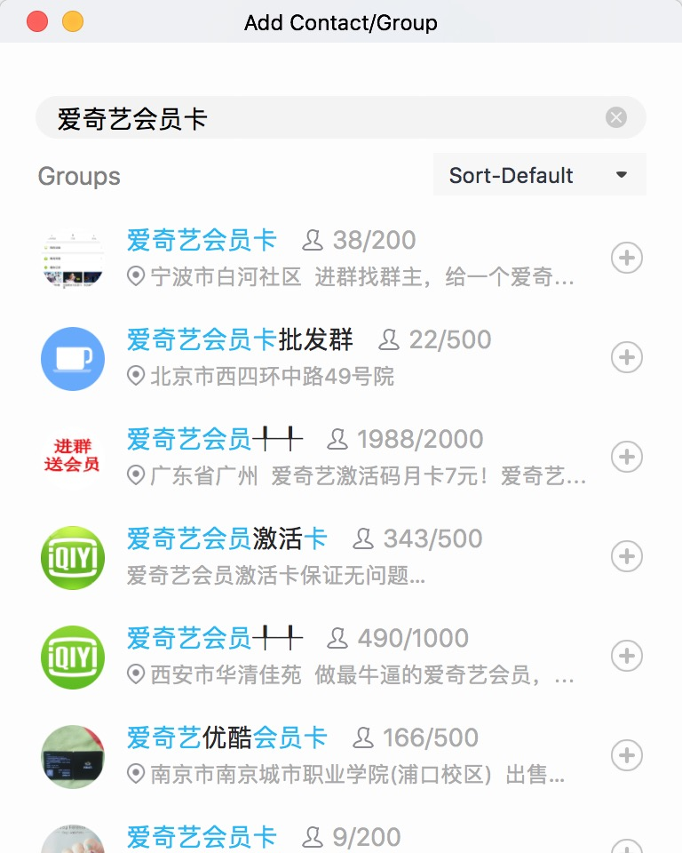
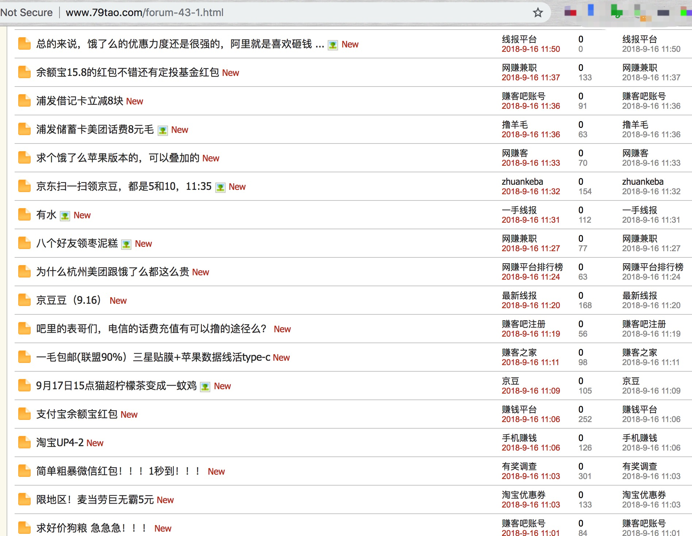
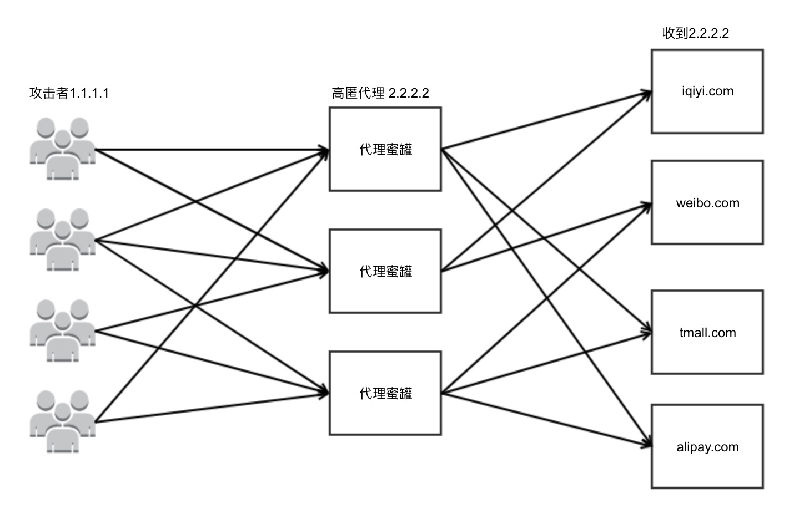

# 蜜罐

在风控中经常要面临这个问题：哪部分流量来自黑产？可信度高吗？

这关系到现有策略效果评估、问题定位、新策略效果评估、模型训练等多个环节。解决这类问题时，蜜罐就起到了一定作用。

## 什么是蜜罐？

通过一些手段，引诱黑灰产通过或攻击普通用户无法触达的资源，从而清晰的将黑灰产和普通用户流量区分的过程。这其中的资源就是蜜罐。

## 引诱手段

引诱手段有很多，大多需要前期混入黑产微信、QQ、论坛进行卧底，再定向散布信息。

QQ群比较好搜，关键字多试一试

论坛这里列一些

* http://www.zuanke8.com
* http://www.79tao.com
* http://www.hym68.com/
* http://www.0818tuan.com/
* http://www.hxwz2.com/
* https://www.iqshw.com/
* https://www.52pojie.cn/

需要注意的有几点：
1. 这些群和论坛里充斥着的不全是黑产，还有很多性质不很恶劣的羊毛党。所以如果你散布的信息仅仅关于便宜的商品，很可能引诱来大量羊毛党（人肉操作为主），而不是更懂技术的黑产（自动化攻击）
2. 尽量使用社交工具的小号进行卧底，避免暴露自己的真实信息
3. 保留论坛截图、聊天记录、转账记录，便于后续起诉

## 蜜罐质量

在整个过程中蜜罐的质量直接决定了最后结果，关键点如下：
1. 能否将黑产和普通用户流量分开。要确保正常用户通过搜索、列表等正常途径访问不到蜜罐，或访问可能性很低。
2. 能否将不同黑产团伙的流量分开。尽量将不同黑产的流量在时间或者资源上区分开，以便后续对不同团伙的手段进行对比。
3. 能否产生足够日志。信息越多，对后续分析越有利。
4. 是否需要登录、VIP身份。这个和蜜罐目的强相关，例如VIP视频防刷、代下单、刷粉丝等业务的蜜罐就至少要求用户是登录状态。在可以实现蜜罐前提后，尽量让黑产暴露出UID。

## 蜜罐分析

具体分析过程不提，这里只提1个重点：着重关注蜜罐最开始的几条请求，因为很可能就是黑产本人发出的

## 蜜罐和安全策略评估

蜜罐很重要的两个功能是现有策略评估和新策略评估。大致关系如下：

现有策略 -> 蜜罐 -> 分析 -> 策略升级 -> 蜜罐 -> 分析 -> ...

很多时候风控团队对现有策略的评估是有很大弹性的，虽然很容易说的请拦了多少，但是说不清漏拦了多少。这时蜜罐就可能派上用场。直接“请”黑产刷一波，到底漏了多少、为什么漏了一目了然。

蜜罐分析、策略升级后，还可以请相同黑产再刷一次，看看新策略效果。多轮多个黑产团伙过后，规则可能会得到优化。只是需要注意的是，因为这一过程均是基于恶意流量制定策略，要防止新策略过于严格导致误杀率大幅上升。例如，分析结果表明100%的黑产流量使用了ADSL频繁更换IP，如果新增一条“ADSL IP就禁止下单”的规则就会导致大量误杀，因为普通用户也会使用ADSL。

## 代理蜜罐

上面介绍的主要是引诱黑产直接攻击蜜罐资源，代理蜜罐不同，黑产并不会攻击代理蜜罐，而是会通过代理蜜罐攻击其他网站。

黑产往往为了隐藏自己的IP地址、频繁换IP，会使用代理攻击接口。有些经费充足的黑产会购买专用代理，有些低配黑产会选择公用代理。对于后者，我们就可以在公用代理中安插我们的代理服务器，那么我就可以获知黑产到底在攻击哪些网站、哪些接口、来自哪里。但有以下几点需要注意：
1. 由于受我们控制的代理仅仅是所有代理中的一部分，所以我们获取的数据也是全部数据的一部分
2. 公用代理蜜罐数据中除了你关心的数据，还会有大量其他公司、爬虫等对自己公司业务安全不大的数据
3. HTTP请求的request body要记录，而不仅仅是URL中的参数

可以从这几个角度进行监控分析
1. 基础统计指标，如量比较大的接口、域名、攻击者IP等
2. 同比和环比趋势，特别是环比趋势
3. 注意数据中出现的新接口，这往往意味着黑产找到了一条新的攻击途径
4. 同一黑产团伙的攻击手法是否变化了
5. 是否有多个团伙有同一请求特征
6. 同一黑产都攻击了哪些业务，业务之间的关系是什么
7. 攻击我们的黑产是否也在攻击别人，是同类型网站吗
