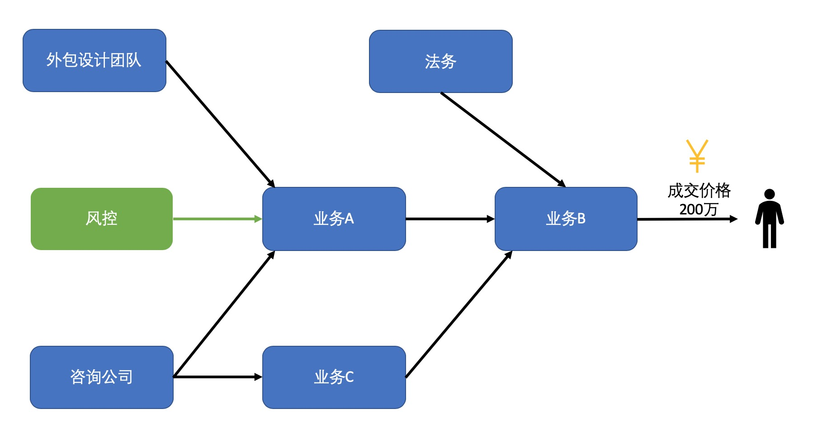
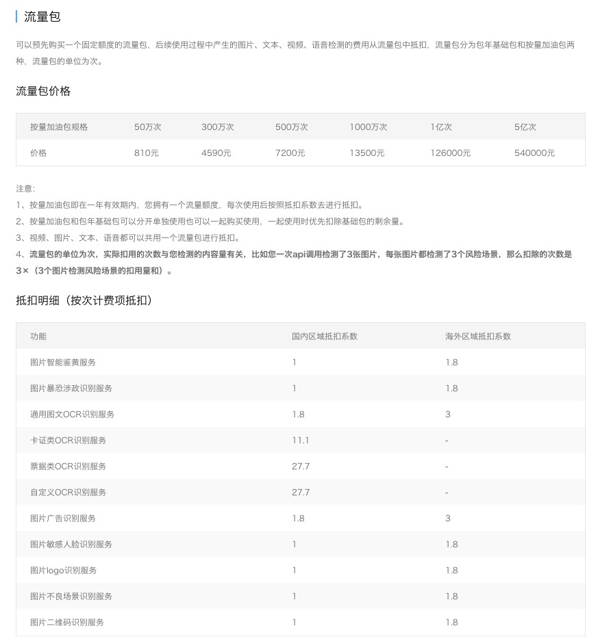
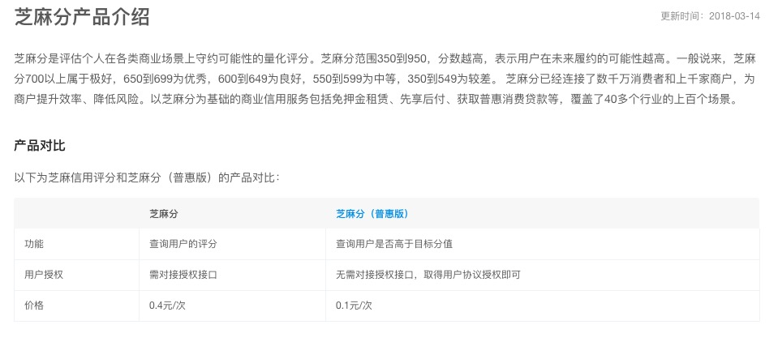

# 风控价值量化评估

前一篇[影响量化评估的两个要素](影响量化评估的两个要素.md)已经论述了为什么量化评估很难。这一篇聚焦在风控行业，谈谈风控价值量化的难点，最后再说说我的解决思路。

难点：
1. 风控产出的是信息，不存在客观唯一正确的价值
2. 当前信息的价值来自于消除了未来的损失。但也正因为损失被消除了，评估不存在的事情很难又很抽象

解决思路：
1. 企业内部市场理论

### 风控的产出是信息
我们先来体会一下管理学大师彼得·德鲁克的一句话。

>知识工作者并不生产本身具有效用的产品。他不生产有形的产品，例如挖一条水沟、制造一双鞋或一个机械零件。他生产的是知识、创意和信息。这样的产品本身并无用途，只有通过另一位知识工作者，把他的产品当做投入，并转化为另一种产出，它们才具有实际的意义。再伟大的智慧，如果不能应用在行动上，也将只是毫无意义的资料。因此，知识工作者必须做到一些体力工作者不需要做的事，他必须具有有效性。而且，他不能只顾到他的产品本身的效用。

工业时代的企业评估大部分职位的方式很简单，就是看生产了几件商品，而商品是匀质、明码标价的，所以比较好评估。但是到了信息时代，大部分职位（例如会计、UI设计师、风控）生产的不再是实体的产品，而是“知识、创意和信息”。这类虚拟的产品首先很难区分质量、很难给出明确价格，其次这类产品很难独立产生价值。

例如你是一名开发工程师，做了个风控后台，每天大家上去用。这个后台很重要，没有这个后台大家都不能工作。但是后台没直接拦截黑产，不同人用出来的效果也不一样，价值咋量化？
（产品经理：你系统至少还有用户用，我的产出是PRD，普通用户根本不用，咋办？）

把风控看做一个整体，风控产出的是信息。例如这个用户是否有风险、这个设备是越狱设备等。这条信息本身没有价值，它的价值来自于信息使用方。

### 个人的风险偏好
风控产出的是信息，根据前一篇[影响量化评估的两个要素](影响量化评估的两个要素.md)介绍过主观价值论，提到了客观的价值是不存在的，有的只是每个人主观的估值。这里继续拓展一步，再聊一聊“风险偏好”。

如果你无法理解风控领域的很多理论，就想想买灭火器，很多时候突然就想通了。

一个家用灭火器的价格是50元，保质期1年，你会给家里买一个吗？你可能会想：
1. 万一厨房着火，烧坏个柜子都不止50元，买一个很划算啊
2. 50元也是钱，我家里从来没着过火，没必要花

第二年：
1. 你买了灭火器，结果一年平平安安的过去了，你还会再买吗？
2. 你没买灭火器，结果有一次炒菜把抽油烟机烧了，花了5000元换抽油烟机，你会考虑买一个吗？

这就要提到心理学中“风险厌恶”的概念

>In economics and finance, risk aversion is the behavior of humans (especially consumers and investors), who, when exposed to uncertainty, attempt to lower that uncertainty. It is the hesitation of a person to agree to a situation with an unknown payoff rather than another situation with a more predictable payoff but possibly lower expected payoff.
>
>  ————Wikipedia

由于每个人对相同风险的心理认知不同，所以给出的主观估值不同，表现出不同的风险偏好。有些人愿意承担更多风险，换取更极端的回报；有些人喜欢安安稳稳，希望别出大事就好。风控对于两类人的价值是完全不一样的，并不存在一个客观的价值。

### 评估没发生的事情
第二个问题是风控领域很有特色的问题。论述前先来看一段孙子兵法：

>古之所谓善战者，胜于易胜者也。故善战者之胜也, 无奇胜，无智名，无勇功。故其战胜不忒，不忒者，其所措必胜，胜已败者也。故善战者，立于不败之地，而不失敌之败也。
>
>        —————《孙子兵法·行篇》

曹操读后批注

>善战者无赫赫之功
>
>        ————曹操《曹选》

这两段简单的来说就是：真正的高手（善战者），在问题（战争）发生之前已经做了充足的准备，让自己立于不败之地。所以很少陷于被动后奇迹翻盘（无奇胜），无法夺得名声和功劳（无智名，无勇功）。当然了我们不能说碌碌无为的人就是“善战者”，这个逻辑不能这么反着推导。这里搬出两位古人的原因是：在风控效果评估的时候，往往也会陷入“善战者无赫赫之功”的困境。

风控很重要的一部分是对项目进行评估，修复可以被利用的漏洞。可正因为漏洞被修复了，黑产就不会攻击并造成实际损失，你也就不知道你到底可以挽回多少损失，你甚至不知道黑产有没有攻击过。

有时候我们是在攻击中制止了攻击，我们也只能算出来已经发生了多少损失、挽回了多少损失，我们还是不知道黑产“本来”可以造成多少损失。

对于这种所以做风控的价值评估，你一定会遇到对没发生的事情进行评估。

### 风控的价格
既然风控并不存在一个客观的价值，那么我们怎么办呢？经济学的答案是“价格”。

>In economics, a price system is a component of any economic system that uses prices expressed in any form of money for the valuation and distribution of goods and services and the factors of production.
>
>经济学中，价格系统是经济系统的一部分，使用价格解决商品、服务和生产要素的评估和分配。
>  ————Wikipedia

前文提到我们评估风控价值的目的是指导工作。团队一共10个人，应该分1个人在A项目上，还是分5个人？人手不够，是不是应该再招一个人做新业务B？两个业务都很急，应该先做哪个？

解决这类问题，“价格”可谓是最高效的方式。
1. 价格能够非常有效、非常节俭、目标非常明确地传递关于稀缺的信息；
2. 价格能够指导人们进行生产，选择不同的生产方式；
3. 价格能够解决奖惩的问题。

评估风控的价值就变成了评估风控的价格，可是怎么评估风控的价格呢？

### 自由市场中风控的价格

在自由市场中风控的价格十分明确，每家公司都会把自己的安全风控产品标出来。如果产品做得不好，就得不到长期的合作合同。

### 价值网络
但是企业内部不是自由市场，风控部门并不会在系统上表示出价格。风控部门服务各个业务部门是职责所在，并不会产生交易，也就不存在什么价格。这就搞不下去了啊。

前文提到风控产出的价值依赖于使用方，那直接问使用方可以吗？使用方很可能也给不出来，因为这个使用方的价值很可能依赖于它的使用方，于是这就变成了一个价值链条。当价值链条互相关联时，又变成了价值网络。

在上图中用户最终向价值网络支付了200万，这个是很明确的。但是风控在一个价值网络里的贡献是多少？这个是很难说清的。

### 企业内部市场理论
企业不是自由市场，但也可以使用自由市场的思想。这就要提到“企业内部市场理论”。

[企业内部市场](https://wiki.mbalib.com/wiki/%E4%BC%81%E4%B8%9A%E5%86%85%E9%83%A8%E5%B8%82%E5%9C%BA)还属于管理学和财务学界的一个前沿理论。但并不是什么高深的新理论，反而一个1965年就被提出来的老理论。实践领域，海尔集团张瑞敏的[市场链理论](https://wiki.mbalib.com/wiki/%E5%B8%82%E5%9C%BA%E9%93%BE%E7%90%86%E8%AE%BA)是一个很好的案例，有兴趣可以点击链接详细读一读。

对于一家企业，销售部门是公司这个价值网络的出口，要把公司的东西卖出去肯定是有价格的。这个价格其实是整个价值网络的价格，并不是销售部门的价格，但是销售部门依然可以依赖这个价格制定计划、跟进进展、比较不同项目，这个价格可以指导销售部门的工作。

企业内部市场简单说就是把市场经济中的利益调节机制引入企业内部。建立一个内部市场交易机制，实现部门之间的产品和服务“买卖”市场化，从而让各部门都产生收益。想办法让企业每个部门都和市场收入直接挂钩。也就是说，把所有的成本中心，都变成利润中心。

比方说，生产部门是给销售部提供产品的，行政是给其他部门提供劳务的，那么这些产品和劳务就可以有相应的定价，让其他部门来购买产品和劳务，这就是这两个部门的收入来源。

### 在公司内部给风控定价

了解了“企业内部市场”的概念，继续来说说落地的要点。

1. 要基于业务团队、风控团队双方估值方式的共识。无论风控团队单方做出来的结果是拍脑门做出来的，还是严格评估出来的，如果得不到业务团队的认可，都是没有用的。
2. 要使用金额作为核心指标。如果各个部门之间的衡量单位不同，那么部门间比较、多个部门汇总的工作也就无法进行了。

那么定价的时候该定多少呢？经济学里，影响价格的因素有很多，这里主要说两点：替代品和必要性

替代品意思很简单，就是说我们可以参考外部替代品的价格，例如公有云的风控产品报价、第三方风控服务厂商的报价。例如下图就是某公有云服务的内容安全服务的价格。往往这是我们定价的锚点。做的不如外部好，定价肯定不能高于外部报价。如果做的好，就可以参考增益效果定价。

其次也要注意必要性，同样一套系统、同样一份数据对于不同业务的必要性是不一样的。金融行业特别需要风控产品，所以类似产品和服务的价格特别高。很多第三方公司对不同行业有不同的产品，我们可以用来参考。例如o2o行业常见的芝麻分，单次调用要0.1元，如果要看具体的分数甚至要0.4元。

### 总结
在现代社会价值网络中，风控作为其中一环节，寻求这一环节的价值是一件不可能的事。但价格可以替代价值，不仅可以起指导资源分配的功能，还更容易发现。

### 参考
* [Price elasticity of demand](https://en.wikipedia.org/wiki/Price_elasticity_of_demand)
* 《财务思维课》贾宁
* 《知识在社会中的运用》薛兆丰
