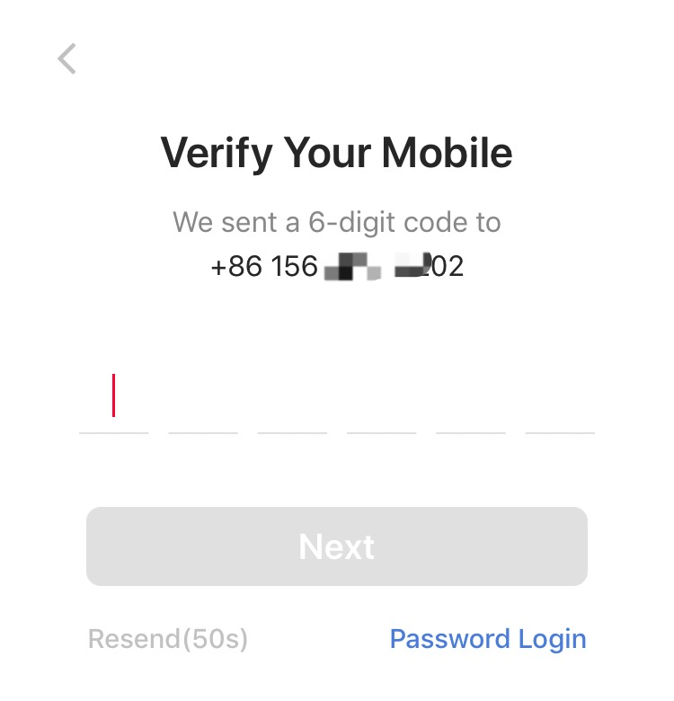
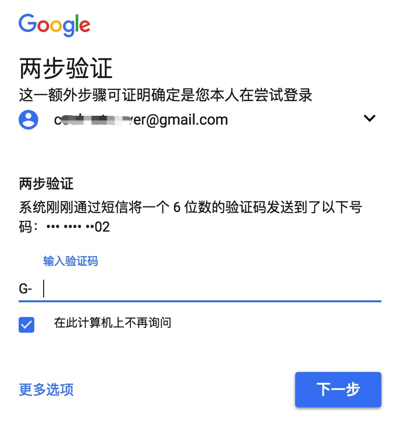
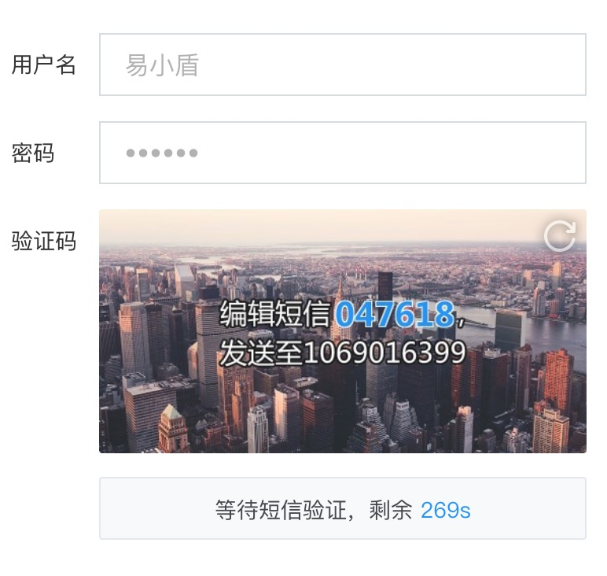
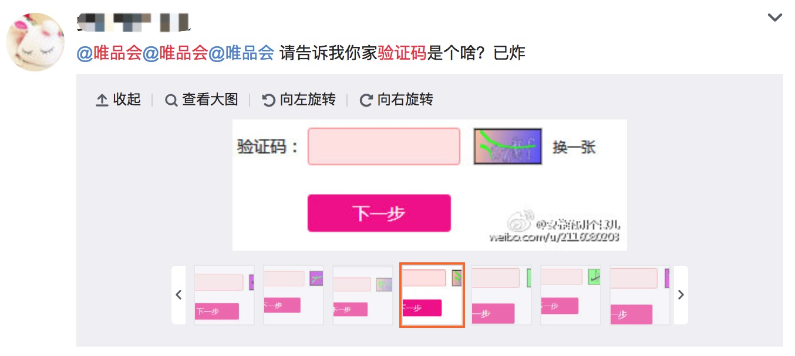
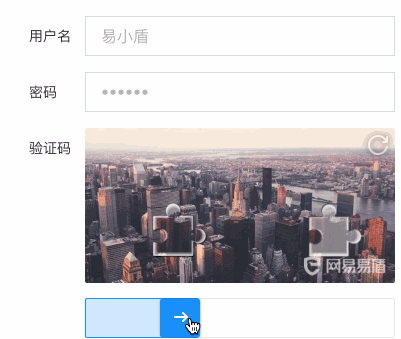
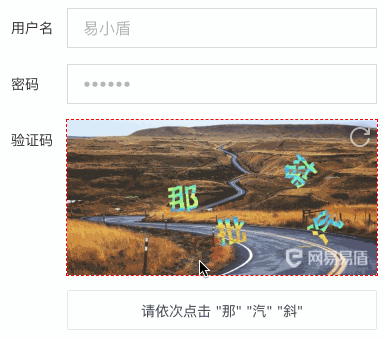
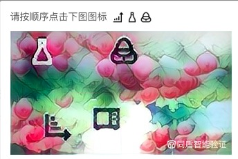
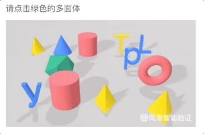

# 验证手段

验证用户身份是大部分网站很常见的功能，在登录、改密码、绑定手机、敏感信息操作时，我们都要求用户“证明自己是自己”。

验证手段最常见的是用户名密码登录，这里的用户名可以是手机、邮箱或者昵称。除此之外，本章再介绍一些其他的验证手段

### 动态密码登陆

2013年-2015年流行一个理念：传统数字密码是落后的、不安全的、体验不好的。很多安全甲乙方公司都在提N年内消灭密码，创造一个没有密码的时代。提出了很多新的验证方式，例如指纹、声音、虹膜等生物特征。其中有些已经广泛普及，有些技术因为准确性不够仍处在实验室阶段，有些受限于硬件未能普及。

截止2018年，很多大厂吹嘘的N年已经到了，可是并没有实现当时说的“消灭密码”。不过也不必较真，用户的验证过程确实有了很多改善。至于未来能不能消灭密码，也许可以吧。

在这场消灭密码的运动中，越来越的公司开始使用动态密码验证（当时这并不是一个新东西）。也就是在登录的时候给用户手机发一个随机数字，用户不需要填密码，填这个数字就可以登录了。

动态密码是真真切切的让用户不需要记忆密码，极大改善了用户体验。可是企业还是会提供传统的用户名密码登陆，原因有3个：
1. 要求用户注册时绑定手机号（这个在国内不是大问题）
2. 短信如果有延迟，用户体验其实更差。如果收不到短信，那就更糟了
3. 对于大厂，短信费也很贵啊

### 扫码登录

扫二维码登录是国内大厂喜欢的电脑端验证手段，本质是用已验证的移动设备来认证电脑端的行为。

使用扫码登录用户确实是不需要输入密码了，甚至连用户名都不需要输入。但是必须要下载相应的App，而且要授权App使用相机的权限。也许这可以提升用户体验，但是也不能强迫用户安装App。所以一般是作为用户名密码登录的补充，不作为唯一验证手段。

下图是Bilibili的扫码登录

### 两步验证

两步验证(2-Step Verification)又叫双因子验证(2-Factor Verification)，简单理解就是除了用户名和密码，还要进行第二步验证。往往是网站向已绑定的手机号或者邮箱发送一串随机数字，用户在网站或者App上填写收到的数字。

下图是Google的两步验证

还有一个类似的思路叫上行短信验证（上面Google的例子是下行短信验证），页面上显示一串数字，请用户使用已绑定的手机向企业的号码发送这串数据。

下图是网易的上行短信校验

上行短信校验比较少见，个人认为是体验问题，用户要输入网站手机号（10位），又要输入随机数（6位），还要花用户1毛钱。体验不是一般差！

## 人机验证

除了要验证用户名和密码是否正确，很多时候我们还需要进行人机识别。

### 字符验证码

最常见的是数字、字母的混合验证码。有效的前提假设是：机器无法识别图片上的数字和字母。实际上这个假设并不成立，现在的OCR技术对于数字和字母的识别率很高。于是大家又加上了中文、模糊、渐变色、扭曲、干扰线、重叠、噪点等手段来提高机器识别难度，这么做确实有效果，但是有时候连人眼都无法识别了，甚至导致过大量投诉。

### 选图验证码

这几年出现了很多非字符的验证码，最有名的当属12306的选图片验证码。

刚上线的时候因为照片分辨率低，加上有一些生僻物品，引起了全网的吐槽，很多人着急抢票，却在验证码这一步耽误了很久。

### 滑动验证码

### 文字点选验证码

### 图标点选验证码

### 语序点选验证码

### 3D图片点选验证码

### 3D推理验证码

## 安全和用户体验的平衡

这么多五花八门的验证码，有的难以攻破，有的已经有不少破解方案，那是不是我们始终用最难破解的就可以了（例如3D推理验证码）？

这里你就需要考虑安全和用户体验的平衡了，3D推理验证码对于机器来说很难破解，因为涉及3D图像物体识别又涉及语义理解。但是这对于普通用户来说也需要花更长时间，对于知道3D推理验证码的用户来说需要大致8-10秒；对于很多第一次见的用户来说，可能完全不知道这是什么东西，选择直接关闭页面。

解决这个平衡有2个思路：
1. 做测试验证哪个验证码更合适，例如 A/B Testing
2. 依据风险动态升级

依据风险动态升级可以理解为：低风险用体验更好的验证方式，高风险用更不容易破解的验证方式。平时用体验更好的验证方式，攻击期间用更不容易破解的验证方式。
